# Configuration and Setup

## Admin Websites
There are 3 main websites to be aware of and bookmark.

### PowerApps 

[URL: http://make.powerapps.com ](http://make.powerapps.com)

  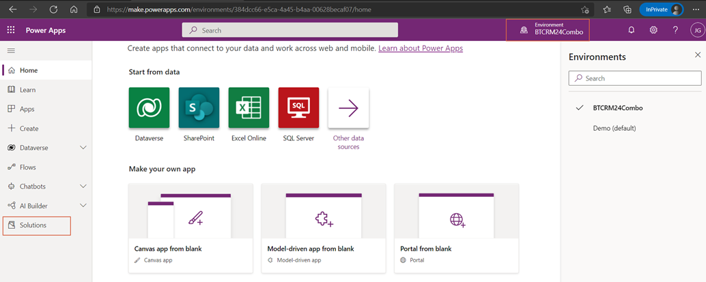

The 2 main things to be aware of here are:
- The environment you are in – if customisations are made, they should not be made in the default environment, but instead in a new environment.
- The Solutions are where you can make all your customisations.

Within a solution, you can see the various tables, views, forms and processes.

  

### Microsoft 365 Admin Centre
[URL: https://admin.microsoft.com/Adminportal](https://admin.microsoft.com/Adminportal)

From within the Admin portal your CRM24 users can be managed.

  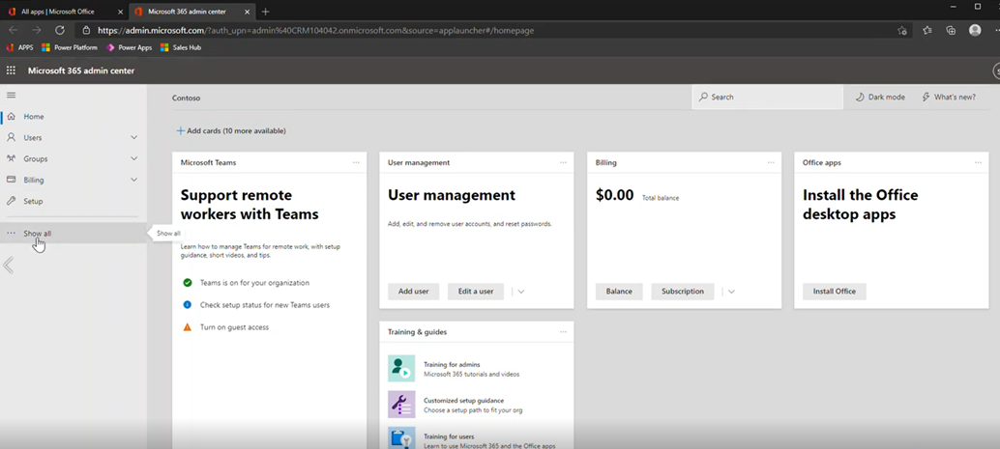

### Power Platform Admin Centre
[URL: https://admin.powerplatform.microsoft.com/environments](https://admin.powerplatform.microsoft.com/environments)

This can also be accessed from the Microsoft 355 Admin Centre.

  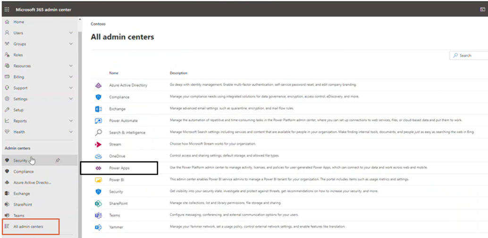

Opening the environment will take you into CRM24.

  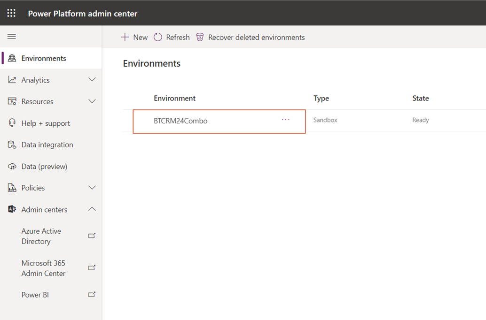

  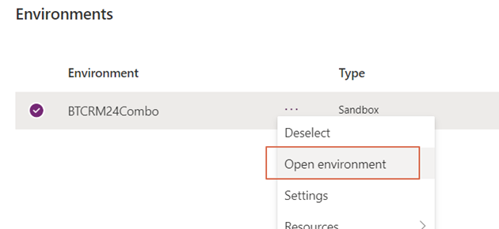

If you choose Settings, from here you can perform most of the settings found in CRM124.

  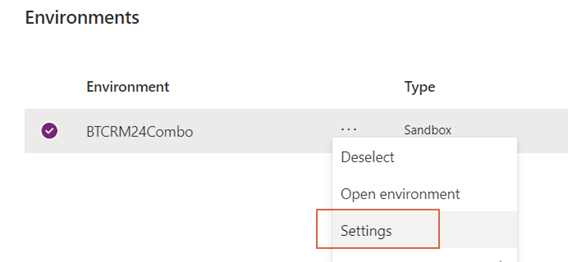

  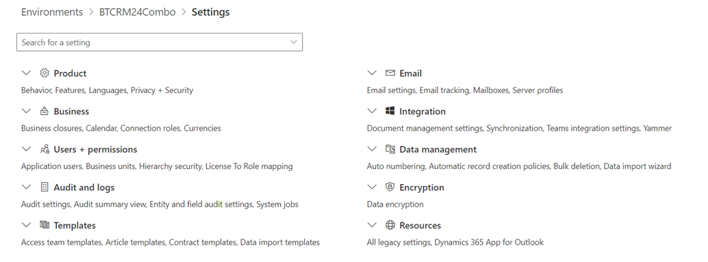

From within CRM24 there is another way to access these settings, but in time these will likely be deprecated.
For now though we will access these same settings from within CRM24 by going to the cog and then choosing Advanced Settings

  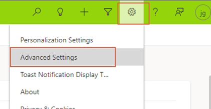

The Advanced Settings are where all customisations and settings can be accessed.

  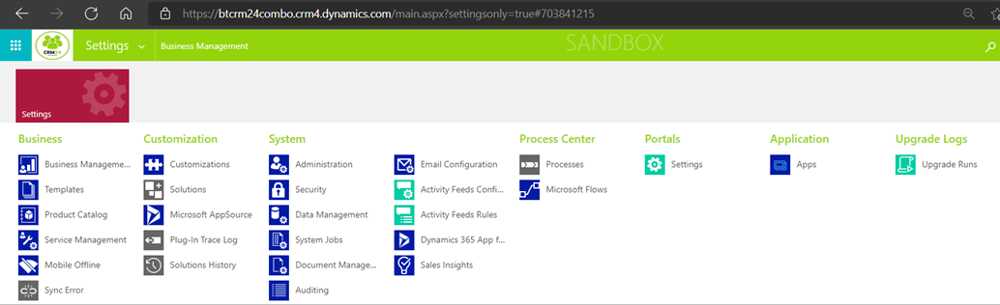

[**⬆️ Back to Top**](#sales-leads-opportunities-and-activities) &nbsp;&nbsp;&nbsp;&nbsp; [**🏠 Home**](/CRM24) 

## Security / Environment Setup

### Set up Business Unit Structure
Navigate to Advanced Settings  Security  Business Units

  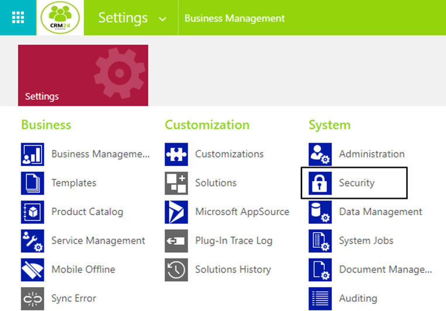

  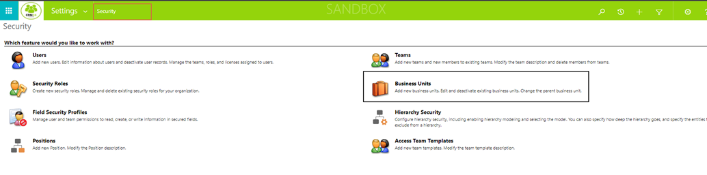

Business units in CRM24 are a business’s departments or divisions.
Business Units control data access. Users can securely access data in their own business unit, but they can’t access data in other business units.
Note the following in terms of business units:
- The organization (also known as the root business unit) is the top level of a CRM24 business unit hierarchy. 
- Each business unit can have just one parent business unit.
- Each business unit can have multiple child business units.
- Business Units can have parent child hierarchy settings.
- CRM24 security roles and users are associated with a business unit. You must assign every user to one (and only one) business unit.
- Security and access privileges can be restricted to Business Unit or Parent Business Unit level (thus also allowing accessibility in all records owned in any child business units under the parent)
- You can assign a team to just one business unit, but a team can consist of users from one or many business units. Consider using a team if you have a situation where users from different business units need to work together on a shared set of records.
  
Create all Business Units as “child” units under the main Parent (your Organisation name) 
 
Click on the “New” button in “Business Units” 
 
  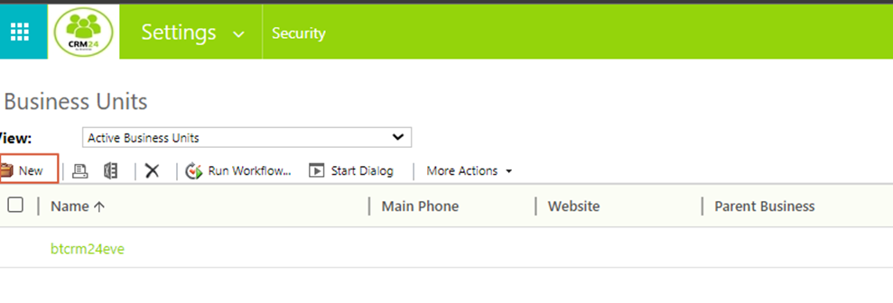

Complete all details, select the appropriate parent for hierarchy, and click on “Save and Close” 

  

Your business unit structure should follow the advised below process 

  
 	
Never Change your Root Business unit 
The Root Business Unit must always be the main Parent to any other business units under it. 

 
### Users Setup
- To have new users added, contact Braintree for license provisioning through the Microsoft CSP portal.  
- The initial user setup will be completed, and you will be advised of the Access Details for the initial users requested. 
- Should you wish to change the security roles, managers, business units or any other demographic information regarding any user, you can follow the process outlined below: 
 
Navigate to:  Advanced Settings ➡️ Settings ➡️ Security ➡️ Users.

  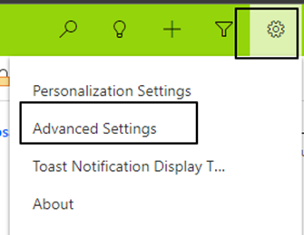

  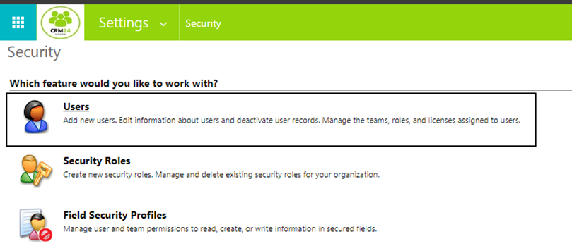

Click on the username you wish to edit.

  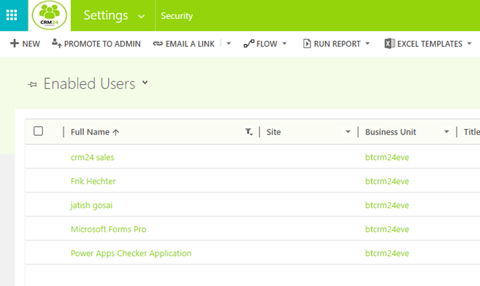

  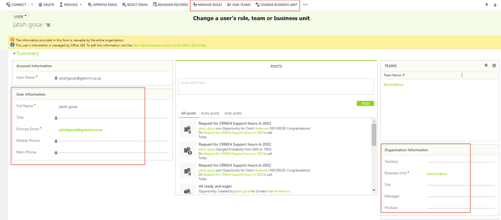

⚠️ Note: 
- When you change the business unit of a user all security roles are removed from the user profile! 
- Access is only possible if a user is enabled and has a Security Role.  
- If you do change a user’s business unit, make sure to click on “Manage Roles” and give the user the required security roles again. 
 
### Teams
In CRM24, we setup a Sales team and a Service team only by default.

  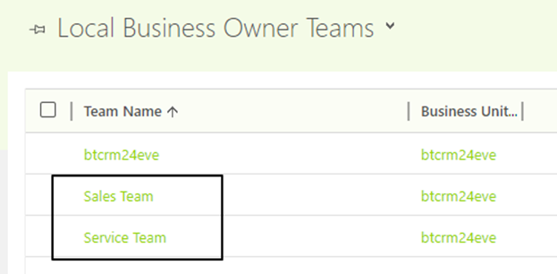

If you want to expand this later you are most welcome. As part of CRM24 we however will just be assigning users to either the sales team or service team or to both.

To Configure Teams click on the team you wish to edit or add a new Team and members usi9ng the lookup.

  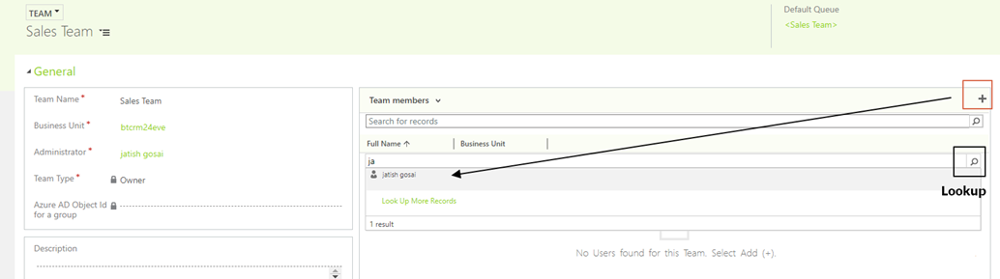

### Roles
Security roles enable administrators to control users' access to data through a system of access levels and privileges. The combination of access levels and privileges that are included in a specific security role sets limits on each user's view of data and on what actions the user can perform with that data.
You can assign more than one security role to a user. The effect of multiple security roles is cumulative, which means that the user has the permissions associated with all security roles assigned to the user.
>Note: Administrators can also create teams, apply security roles to those teams, and add users to each team. All users that belong to a team inherit the security roles applied to that team for as long as they remain a member, and lose those roles as soon as they leave the team (other than roles also granted to them personally or by other teams they are on).
To the Sales team we will by default assign the “Sales Manager” role, and to the Service Team we will be default assign the “CSR manager” role. These roles then filter down to the user when they are assigned to the teams.

In CRM 24 we setup a Sales team and a Service team only by default.
You can expand this later if necessary. 

Navigate to “Manage Role” to change the role(s) for a user.

  

## Business Management Setup

  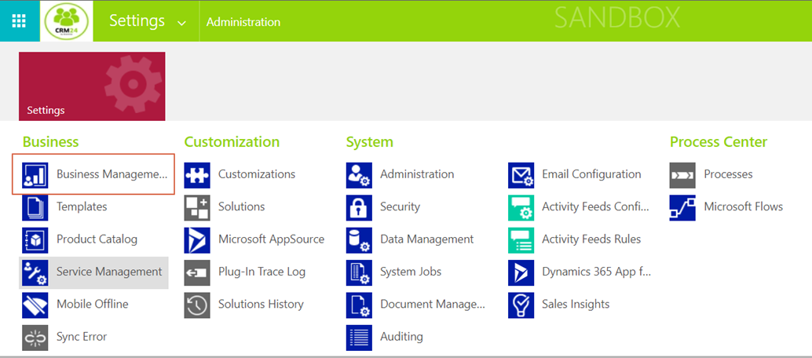

### Fiscal Year Settings
Navigate to Settings  Business Management  Fiscal year Settings.

  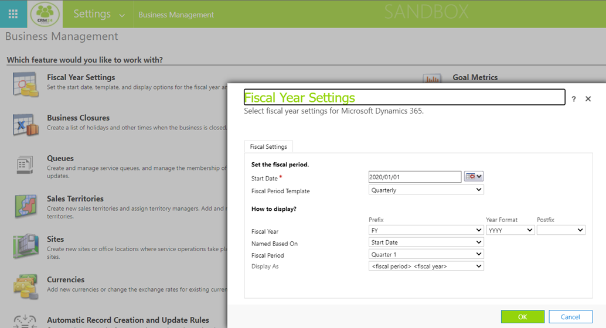

Here you can enter the 1st day of the fiscal year.

### Business Closures
Navigate to Settings  Business Management  Business Closures.

  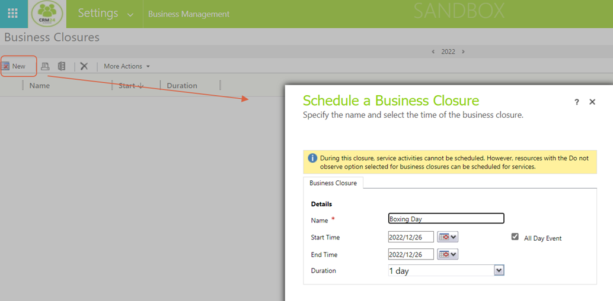

During this closure, service activities cannot be scheduled. However, resources with the “Do not observe” option selected for business closures can be scheduled for services.

### Currencies
Navigate to Settings  Business Management  Currencies.

  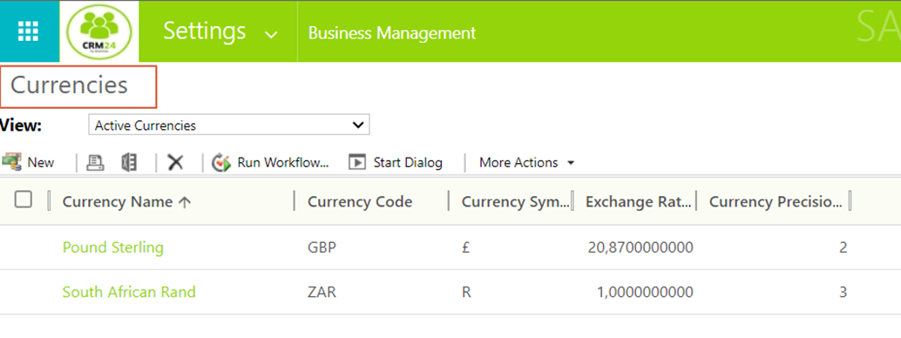

The currencies created here can be used when quotes, orders or invoices are created.

### Sales Territories

  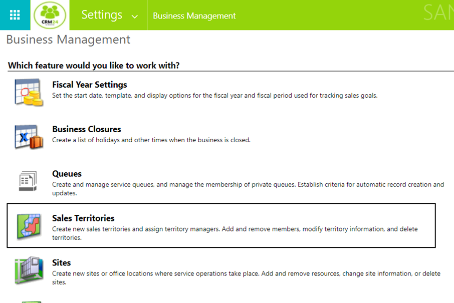

Sales Territories can be set up and managed from here i.e. add and remove members, modify territory information and delete territories.

### Sites

  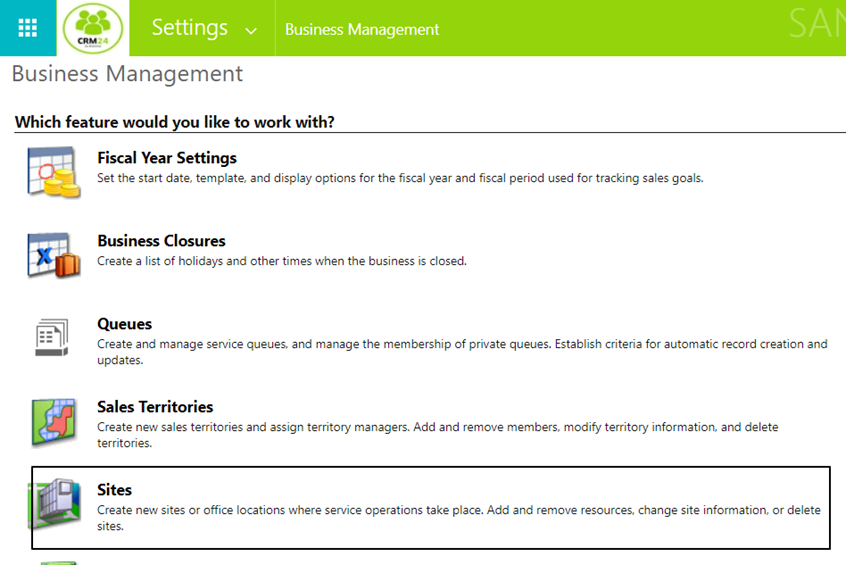

Sites (or office locations) are defined here and represent the locations where service activities take place. 

### Outlook Integration
In terms of Outlook integration – there is also a role called “Dynamics 365 App for Outlook user”.

Adding a user to a team with a assigned role of “Dynamics 365 App for Outlook user” means that the user will be able to from their Outlook have interaction to CRM24.

>Note: If users use the online version via the browser, and want Outlook integration, they will need to download and install an addon.

>Note: An admin will be required to approve email for each user who needs to be able to use their email in CRM24.

  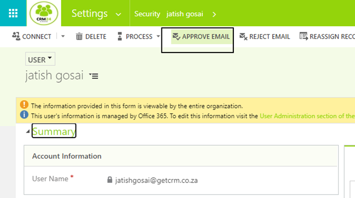

In the Email Configuration this can be seen.

  

### Configure Queues
Queues are instrumental in organizing, prioritizing, and monitoring the progress of your work while you are using CRM24. 
As a central location for work management, queues assist you in processing cases, responding to service calls, or sending out product information to prospective customers. 
A queue is a collection of queue items. A queue item serves as a container for an entity record, such as a task, an email, or a case that needs processing.

With service management, cases can be assigned to a queue and then any user who belongs to a queue can access the detail in the queue.

>Note: Queues can be set up with a mailbox so that if anyone sends an email to that mailbox, it is automatically added to the queue, and the users in the queue can then access and respond.

To set up a queue: navigate to: Advanced Settings → Settings → Business Management → Queues 

  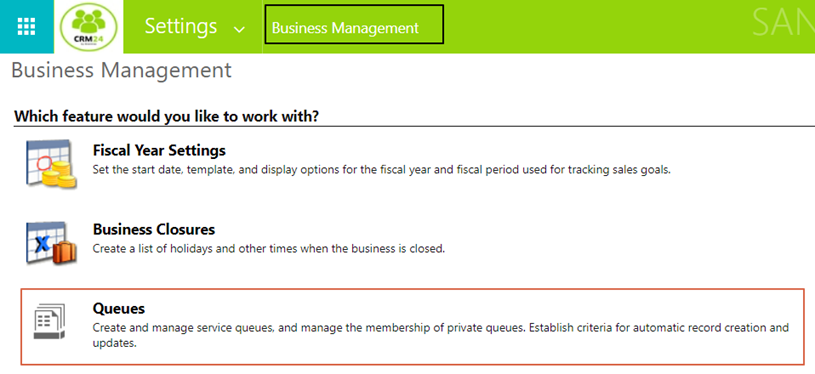

Click on the Queue you wish to edit, or add a new Queue and members.

  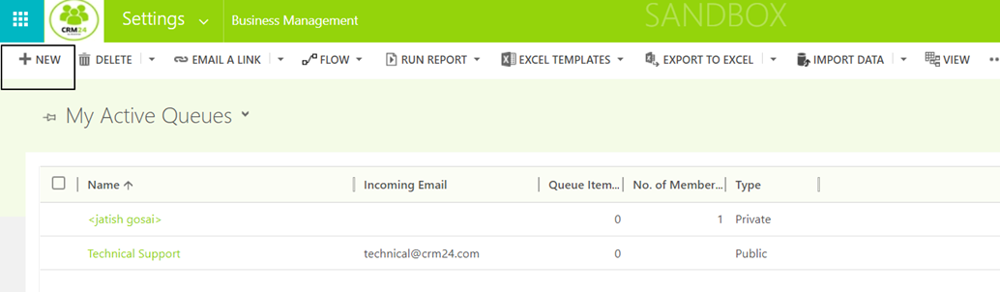

>Note: Queues can be Public or Private 
>- Public: Everyone has access 
>- Private: Only added members have access 

  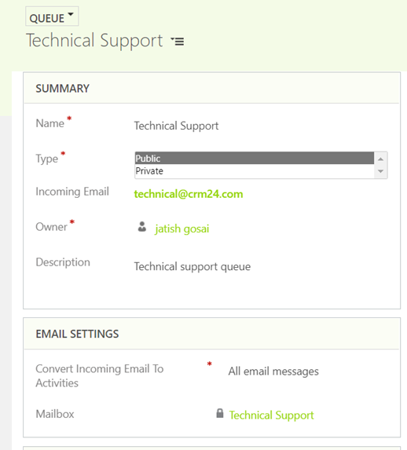

### Subjects

  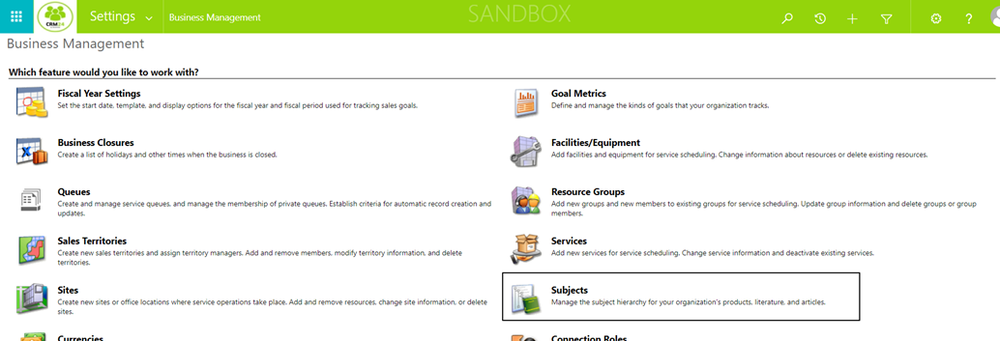

Here, you define a subject organizational structure that lets you mark and categorize service cases, knowledge base articles, products, and sales literature. By using the subject hierarchy, you can classify service cases to quickly provide service to your customer.

## Product Catalog

  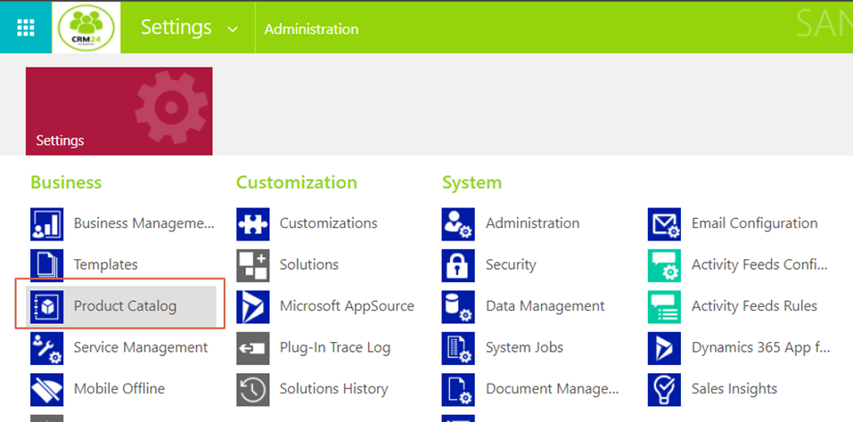

  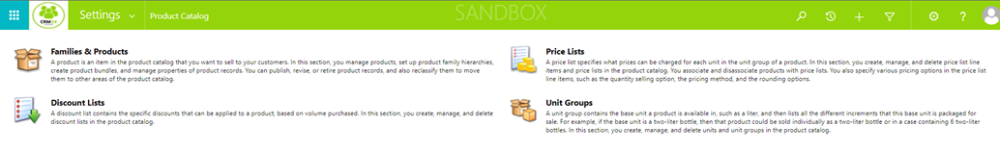

The products, product families, Price Lists, Discount Lists and Unit Group can all be set here.
They need to be set up prior to being able to add a product to a Sales Quote, order or invoice.

### Products, Families and Bundles

  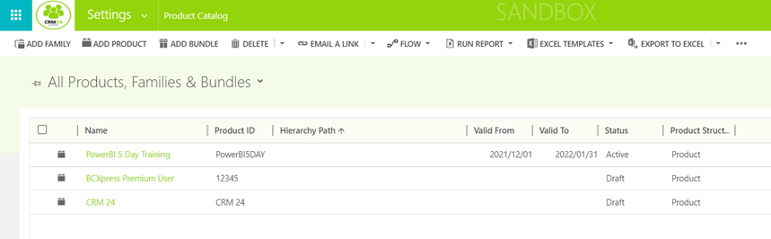

Products are the backbone of your business. They can be physical products or services — whatever your organization sells. Your sales reps use the products you create in Sales to generate sales quotes, marketing campaigns, orders, and invoices. Your customer service reps might also use them when they create customer service cases.

  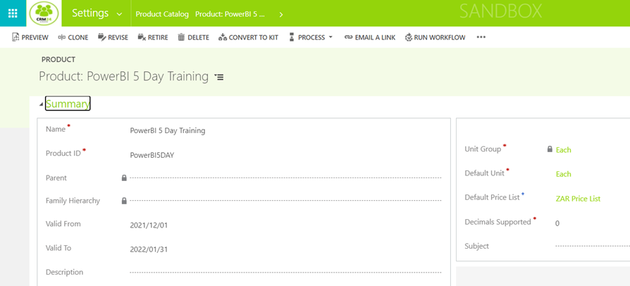

When completing the product, some fields are mandatory:
- Valid From/Valid To: Define the period the product is valid for by selecting a Valid From and Valid To date.
- Unit Group: Select a unit group. A unit group is a collection of various units a product is sold in, and defines how individual items are grouped into larger quantities. For example, if you're adding seeds as a product, you may have created a unit group called "Seeds" and defined its primary unit as "packet."
- Default Unit: Select the most common unit in which the product will be sold. Units are the quantities or measurements that you sell your products in. For example, if you're adding seeds as a product, you can sell it in packets, boxes, or pallets. Each of these becomes a unit of the product. If seeds are mostly sold in packets, select that as the unit.
- Default Price List: If this is a new product, this field is read-only. Before you can select a default price list, you must complete all the required fields and then save the record. Although the default price list is not required, after you save the product record, it is a good idea to set a default price list for each product. If a customer record does not contain a price list, Sales can use the default price list for generating quotes, orders, and invoices.
- Decimals Supported: Enter a whole number between 0 and 5. If the product can't be divided into fractional quantities, enter 0. The precision of the Quantity field in the quote, order, or invoice product record is validated against the value in this field if the product does not have an associated price list.
- Subject: Associate this product with a subject. You can use subjects to categorize your products and to filter reports.

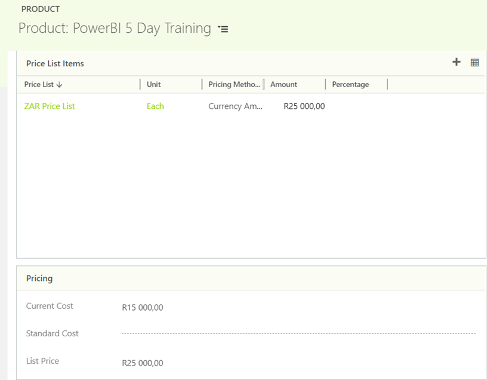

### Price Lists

Price levels can be created and different products associated with those price levels.

### Unit Groups

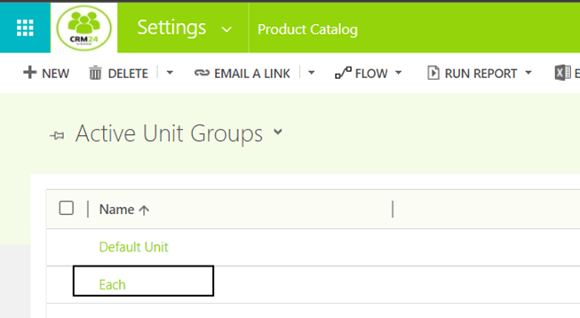

Unit Groups are defined as per how a product is sold i.e. in what unit it is being sold.

### Discount Lists

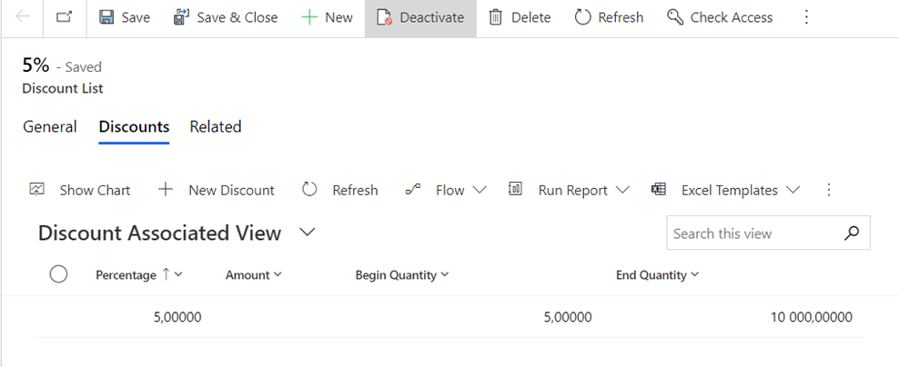

Discounts can be set up and can be made dependant on the quantity of the product being sold.

## Administration

### System Settings
Navigate to Settings ➡️ Administration  System Settings.

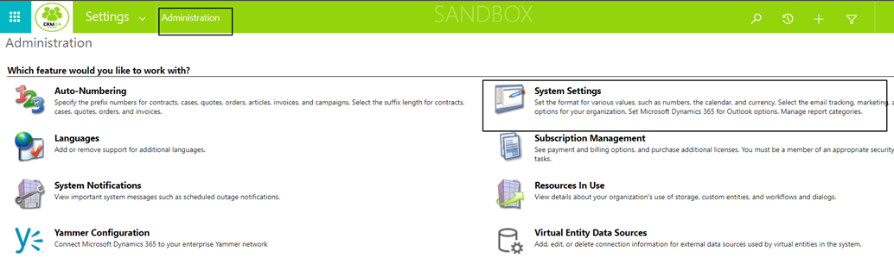

>System settings should not be changed from the initial setup by anyone without the appropriate Dynamics 365 Experience, as it can adversely affect the performance of the entire environment. 

Some of the key settings to note are discussed below.

**Country Code**
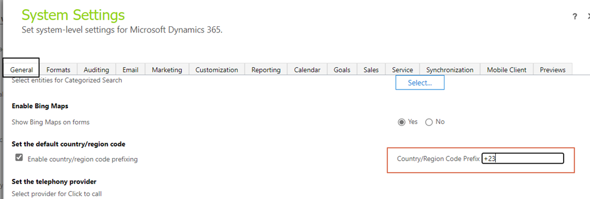

**Regional number, currency, time and date**
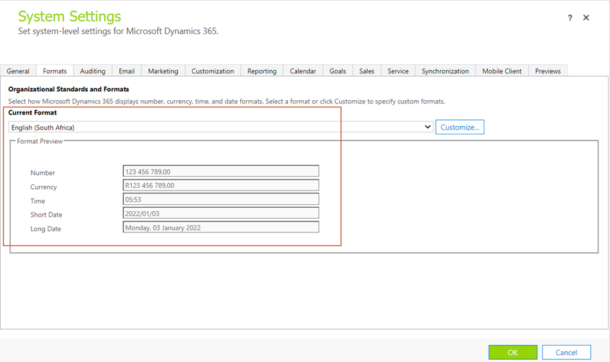

**Auditing**
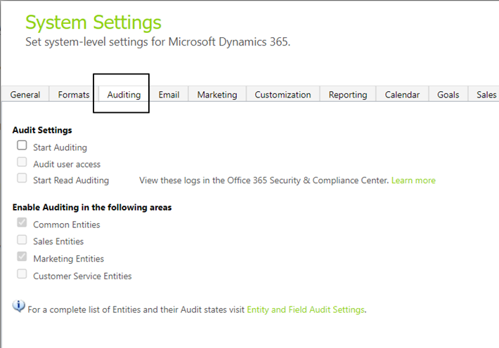

Auditing allows you to see changes made by users in the system to records. 
Auditing can be enabled at each entity or at a field level, however with CRM24 by default we provide the option to turn on or off auditing for the Sales module and or Service Module only.

**Email Server Profile**
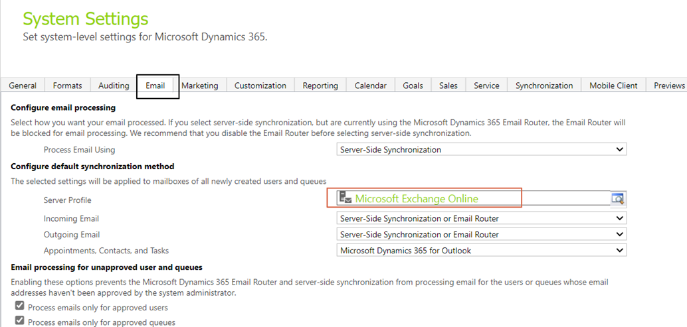

The Server profile is set by default to: Microsoft Exchange Online

**Reporting**
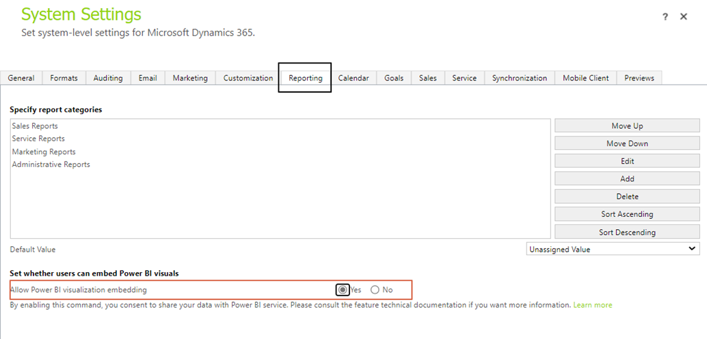

Where custom Power BI reports are created in the Power BI Service and you want these to be embedded in CRM24, then the highlighted option needs to be marked as “Yes”.
 
## Processes

### Business Process Flows
Navigate to: Settings ➡️ Processes.

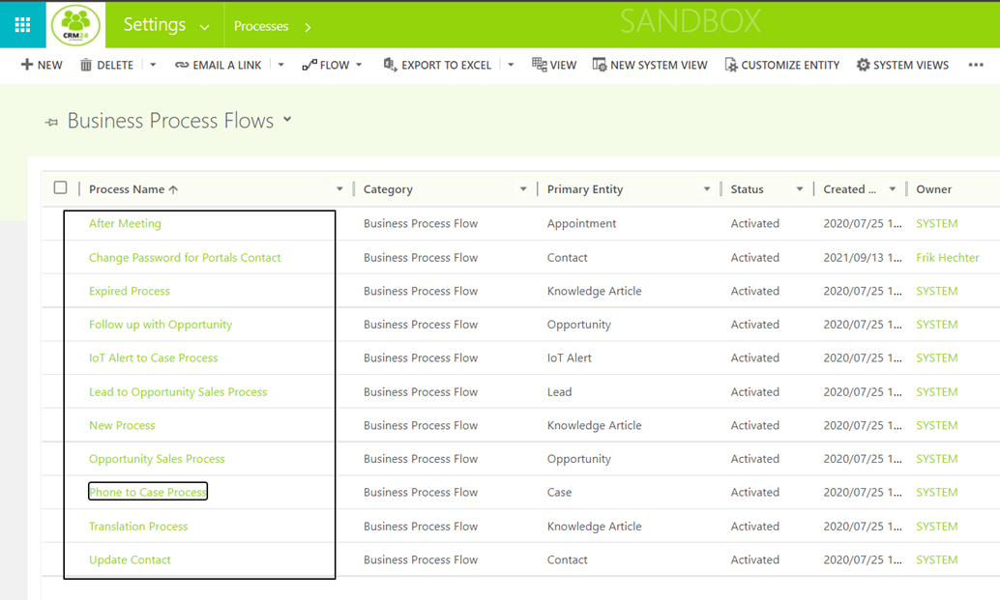

Add a filter to the Category to only show Business Process Flows.

A number of business process flows have been created by default for use.

In the “Phone to Case Process” in services (cases/incidents), we have 4 stages in a process: Identify ➡️ Research ➡️ Escalate ➡️ Resolve.

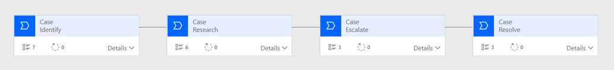

In the sales “Lead to Opportunity” and “Opportunity Sales process” business process flows, we see 4 stages.

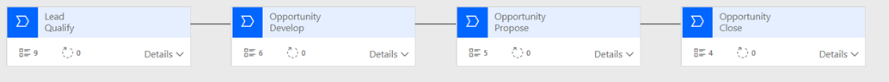

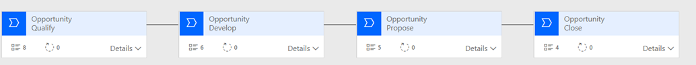

A stage is what we see when we are working through the capture of information for a particular area i.e. the lead to opportunity process.

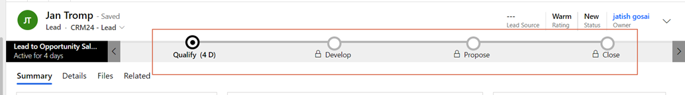

In PowerApps the fields needed to be completed within each stage are defined.

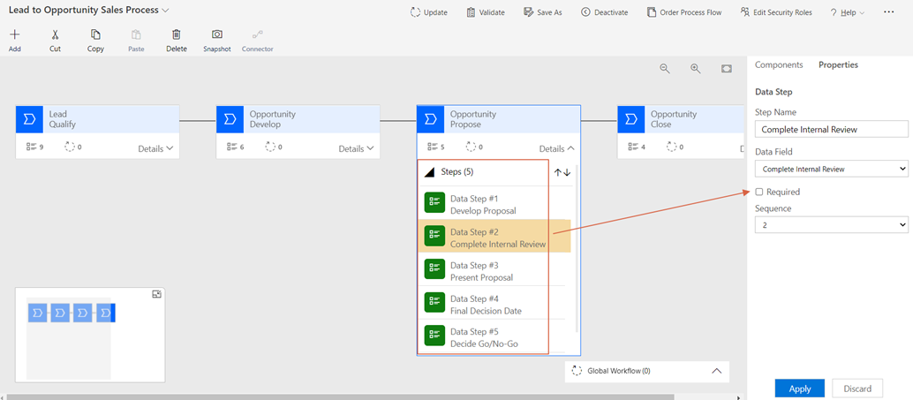

In the business process flow, conditions can be added, as well as Workflows and Action Steps.

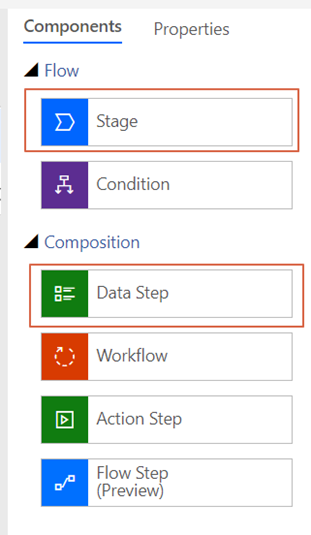

### Workflows
Workflows are used to automate certain actions. They can be used to notify users of changes and send emails, or to change the status of records. 

By default we provide a number of default workflows for Sales and Service, however as a start these are mostly not activated.

**Sales**
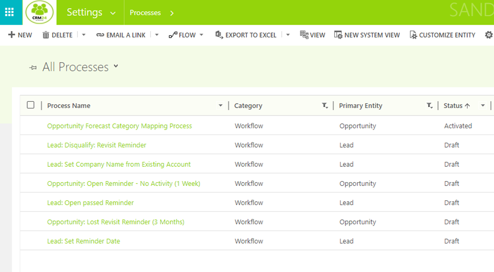

**Service**


On each workflow, various steps are set e.g. on the Lead, there is a workflow for “Open Passed reminder”.


One step involves sending a reminder email – by clicking on Properties, the email can be defined according to your need.


## Imports
Using the Data Import Templates provided, populate with the data you wish to import.  
- Do not remove or expand columns A, B or C 
- Copy data in columns  
- Take note of data types 
- Where Option sets – use available options only  
- Where Lookup – value must already exist in the system existing data 
- Where numerical – take note of limitations on number ranges  

**Navigate to Data Management**
In the Settings Dropdown, click on the dropdown arrow, then scroll to Data Management. Click in the Data Management Tile to open.


**Open the imports area**


Click on Import Data.


**Select Import Template**
- Open the “Import Data” wizard, select the Import Template File.
- Click on “Choose File” – select the template to be imported .
- Click Next to proceed.


**Select the prepopulated template**


***Review Settings***
- Allow Duplicates: Decide if you want to allow duplicate values or unique values only .
- Select Owner: Which system user will be the owner of the records imported 
- Click on “Submit” .
 
 

**Finish Import**


**Monitor Success**
Under Settings >> Data Management, check under the Status columns 
-	Success: Successful Records Imported and Created 
-	Errors: Records that failed and were not successfully imported


Compare successes against Total Processed when status is “Completed”


When Complete, the import process is complete.  
If Errors, open the Import File, read error message, fix data in template accordingly, rerun import. 

[**⬆️ Back to Top**](#sales-leads-opportunities-and-activities) &nbsp;&nbsp;&nbsp;&nbsp; [**🏠 Home**](/CRM24) 