# Customer Accounts and Contacts

## Accounts
Use the side navigation Pane to see the List Views on Accounts

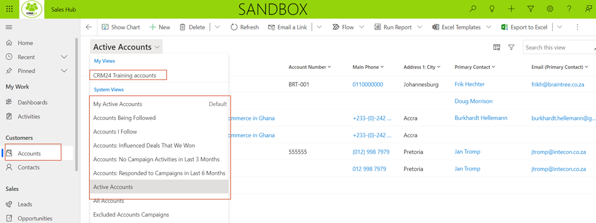

Click on a record to Open / view / edit. In an opened record, use the top command bar buttons to perform actions on that record.

Summary:
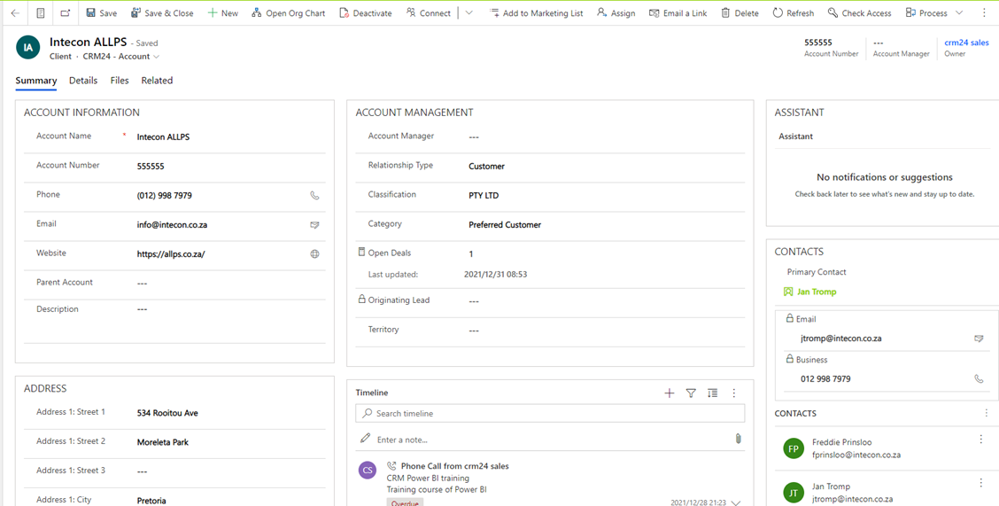

Details:
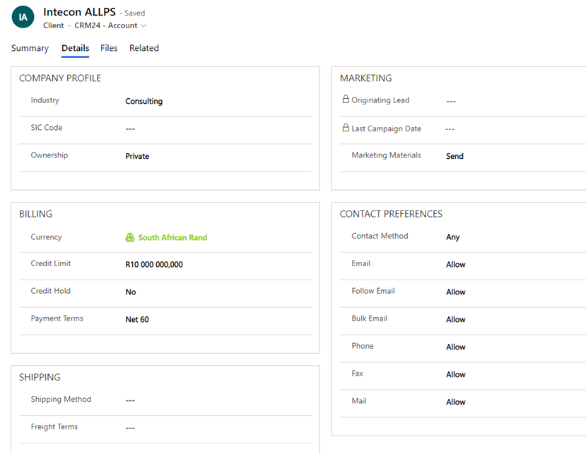

Various other related records can be added to an Account

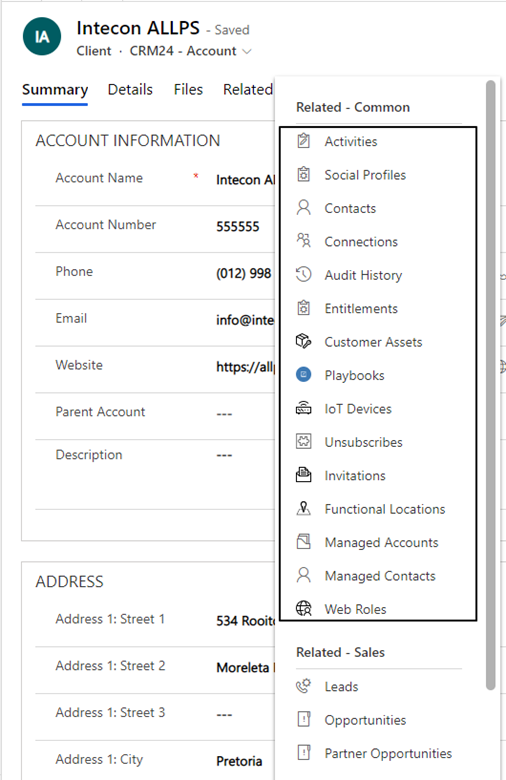

Activiites i.e. Tasks can be created on the Account

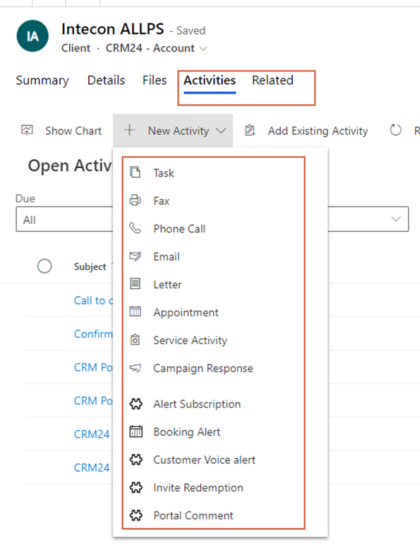

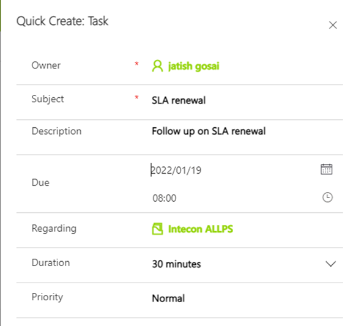

## Contacts
Use the side navigation Pane to see the List Views on Accounts

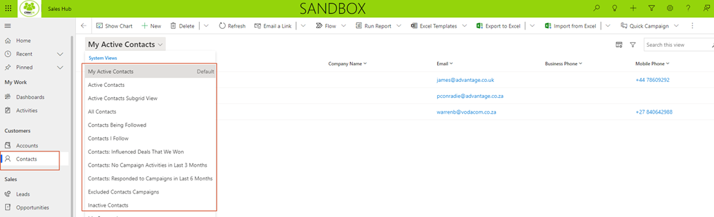

Summary

Detail

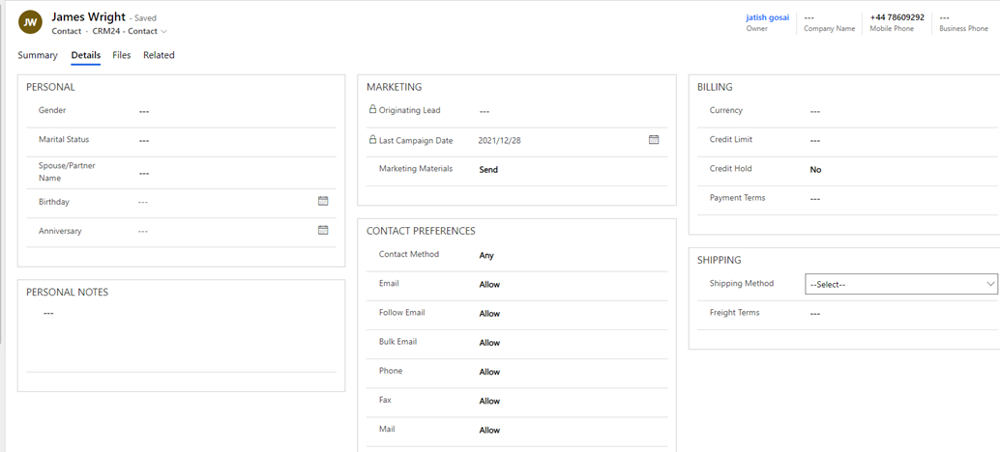

Various other related records can be added to an Account

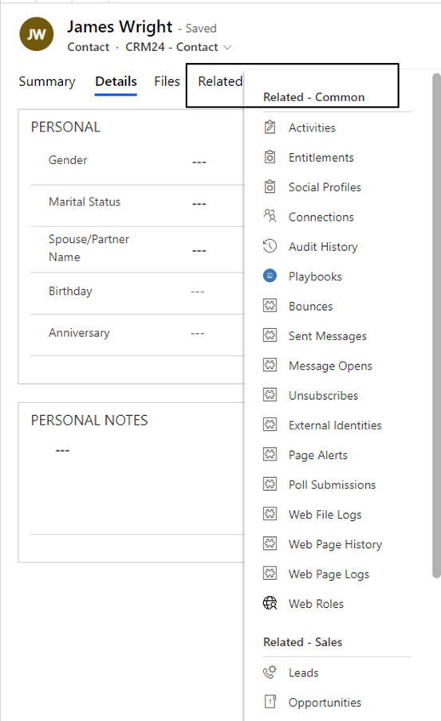

Activities can be created against Contacts

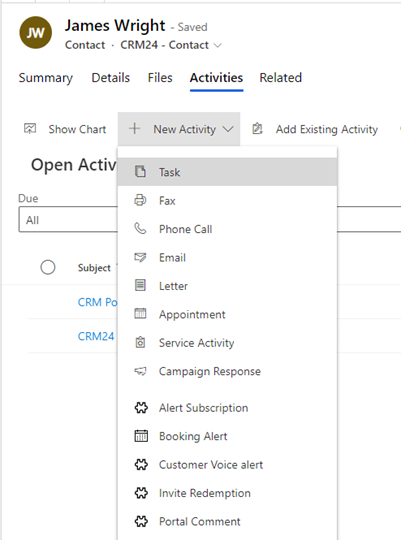  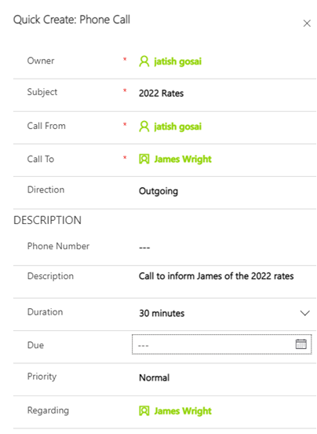

[**⬆️ Back to Top**](#sales-leads-opportunities-and-activities) &nbsp;&nbsp;&nbsp;&nbsp; [**🏠 Home**](/CRM24)