# Getting Started on CRM24
Access your environment by opening your web browser and browse to the URL provided to you by Braintree, which will look something like this:

        https://{yourorgname}.crm4.dynamics.com/main.aspx

Enter the admin user name and password:

    

- [Navigation](#navigation)
- [Theme, Colours and Logos](#theme-colours-and-logos)

## Navigation
The BTCRM24Combo Business App opens in the following page:

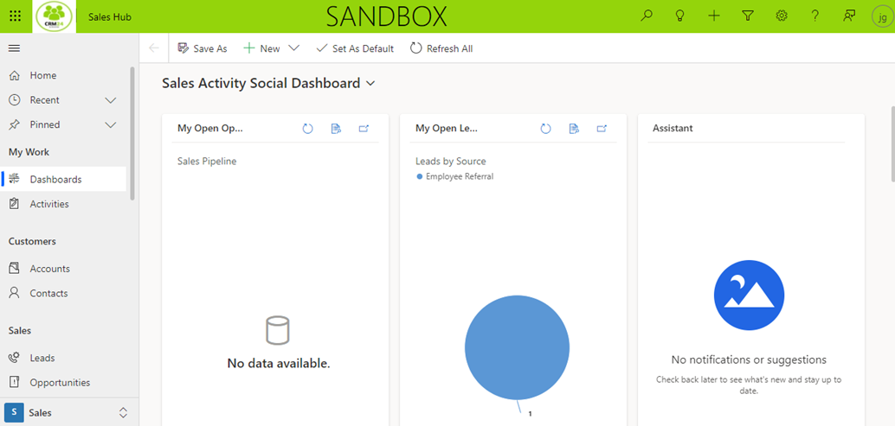

Navigation within the app is located on the left side of the page. This is known as the site map.

There are different areas, such as
- dashboards 
- activities
- other entities
- tables 
  - accounts
  - contacts
  - leads
  - opportunity

- [Navigation Pane](#navigation-pane)
- [Dashboards](#dashboards)
- [Timeline](#timeline)

At the bottom left, you can change the area within the app.

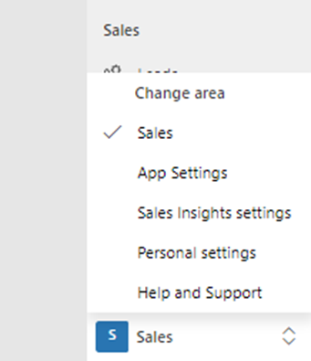

### Navigation Pane
To navigate your CE Application, use the Navigation Pane on the left:
    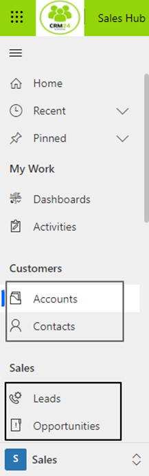

To switch between the Sales Hub or the Service Hub, simply click on the existing hub e.g. Sales Hub, found on the top of the page next to the CRM24 icon
    
    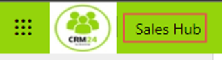
    
    

As part of CRM24, the 2 apps that are available for use are
- Customer Service Hub
- Sales Hub
  
After selecting Service Hub, the navigation pane on the left will have a few different options, now relevant to the Service Hub

    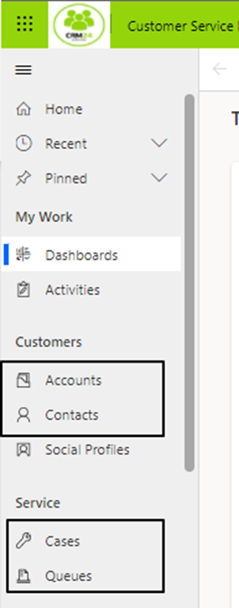

For easy navigation, you can use the “Recent” area to navigate to areas recently visited:

    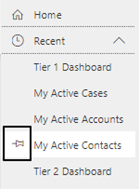

To pin items from recently viewed record types to see them under “Pinned” area

    

[**⬆️ Back to Top**](#navigation) &nbsp;&nbsp;&nbsp;&nbsp; [**🏠 Home**](/CRM24)

### Dashboards
For both the Sales and Service areas there are a number of default dashboards that can be viewed.

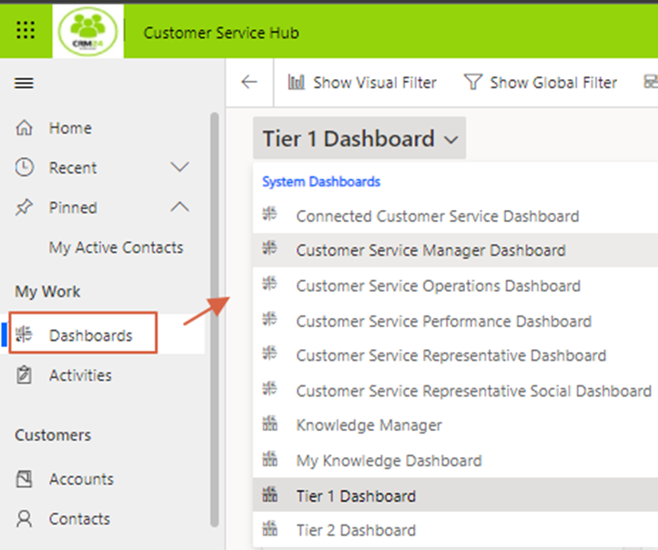

Each of these dashboards is customised to show relevant data
e.g. Tier 2 Dashboard

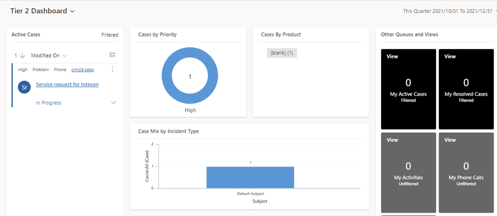

For the specific list you can use the dropdown next to the view name and choose the appropriate option:

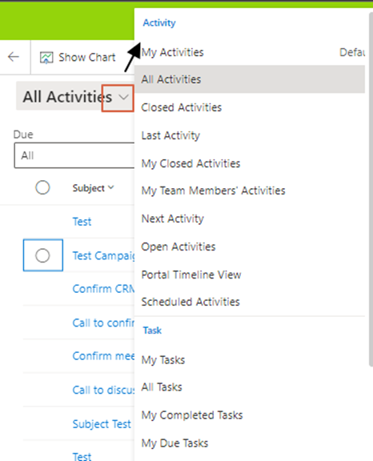

Use the command bar buttons at the top to create new records.

- New Appointment

    

- New Account

    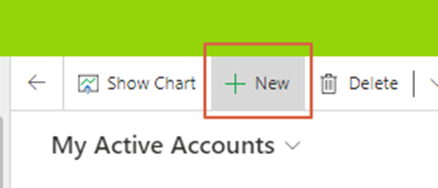

The details of the new record can then be completed and saved e.g. new appointment.

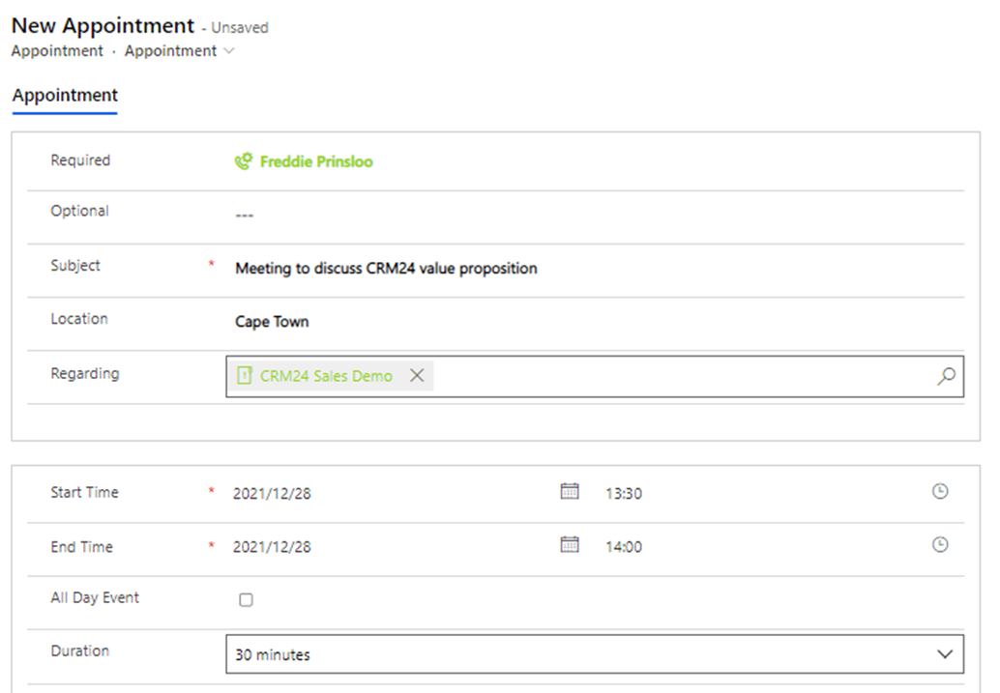

>Note: The red Asterix indicates required fields. If you try to save a record without completing all required fields you will receive an error showing you the fields needing to be completed.

When a list of records is displayed from a view, click on the name of the record to open that record.

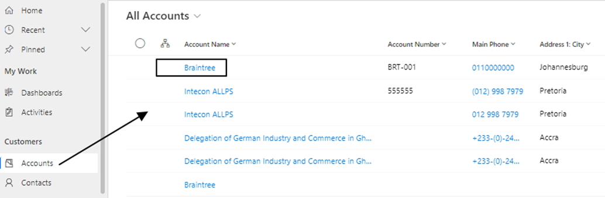

The record is then opened for viewing or editing

[**⬆️ Back to Top**](#navigation) &nbsp;&nbsp;&nbsp;&nbsp; [**🏠 Home**](/CRM24)

### Filtering and Searching

**Global Search:**  The global search is very useful to search across various entities i.e. Clients, Contacts, Leads etc

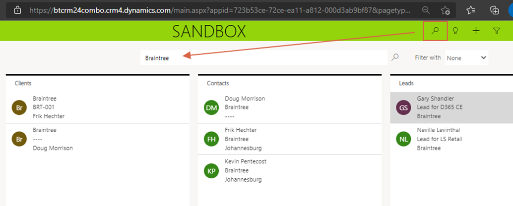

**Advanced Find:** allows you to build personal views. You could start with a default view and then save it with a new name, and thereafter edit the columns and properties and filters used.

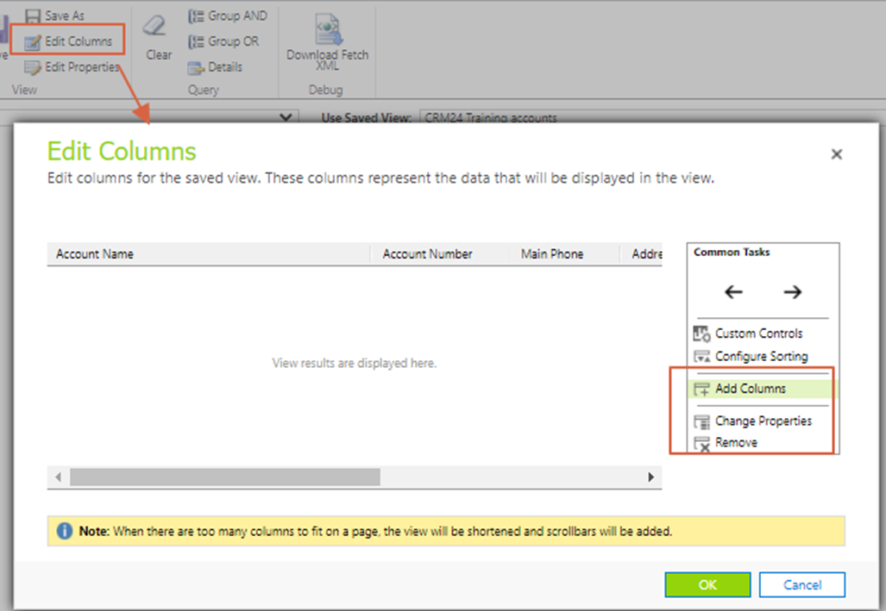

These Personal Views can be used for ad hoc reporting, for instance to export some lists to Excel.

The Advanced Filter can be used to restrict the list based on certain applied column filters.

After clicking on the Advanced Filter:

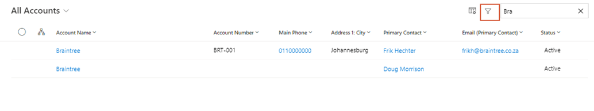

Various fields can then be used to apply filters to the list

Another way of applying a column filter is to click on the column and choose to Filter By

[**⬆️ Back to Top**](#navigation) &nbsp;&nbsp;&nbsp;&nbsp; [**🏠 Home**](/CRM24)

### Timeline
With your timeline, you can create different activities, notes with attachments and other posts. Within the timeline you could filter by record type such as the different activity types, for example just emails or just phone calls. 

[**⬆️ Back to Top**](#navigation) &nbsp;&nbsp;&nbsp;&nbsp; [**🏠 Home**](/CRM24)

### Personalisations
Using the ⚙️ Gear in the top right of the window, you can access **Personalisation Settings**

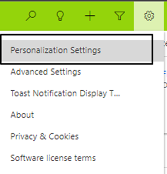

This is where you can modify certain settings that relate to your login only, for example Number of records to display on a page (useful when needing to export records to Excel), or an email signature.

[**⬆️ Back to Top**](#navigation) &nbsp;&nbsp;&nbsp;&nbsp; [**🏠 Home**](/CRM24)

## Theme Colours and Logos
The system theme colours of CRM24 can be changed to match your organisations theme colours. You can also add a logo.

This is done from within Settings ➡️ Customisation

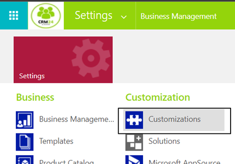

then choosing **Themes** 

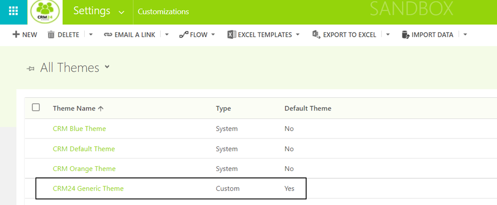

New themes can be created by licking on **New**.

Existing themes can be cloned by clicking on **Clone**.
Once a theme has been created or edited, to make it the active theme, click on **Publish Theme**

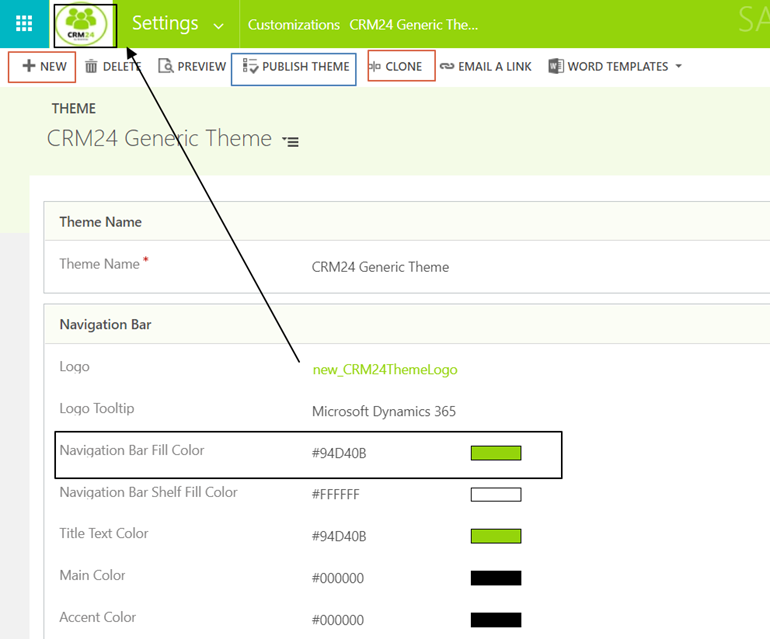

>Note: The logo 1st needs to be added as a web resource before it can be used
>Navigate to Settings - >> Customise the system

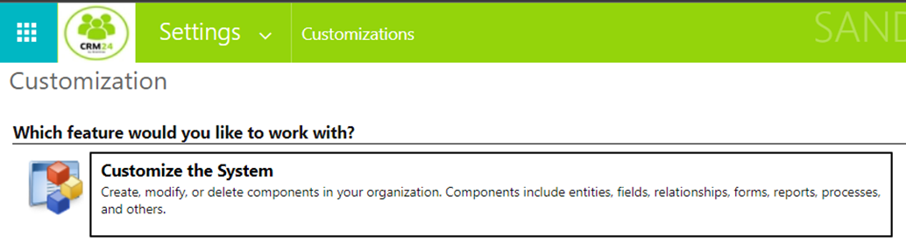

Navigate to Components - >> Web Resources

Choose to Add a New web resource.

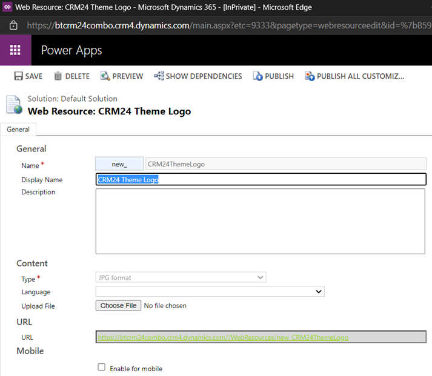

[**⬆️ Back to Top**](#navigation) &nbsp;&nbsp;&nbsp;&nbsp; [**🏠 Home**](/CRM24)