# [Sales Leads, Opportunities and Activities](SalesLeads)
A **Lead** is potential business, the first stage of the sales process. 
When you have a lead, there is a requirement to follow up on the lead to gauge whether the prospective customer is still interested. 
From the **Lead** stage, we can convert the lead to a opportunity by **qualifying** it. We can also disqualify the lead if the prospective customer no longer wants to purchase the product. If the lead is disqualified then the sales process stops.

If the lead is **qualified**, a contact record and an account record are created automatically. 
There are typically two types of entities involved in the sales process:
- Account:  a company or an organization from which we get business. 
- Contact: an individual from which we get business

There are two ways to create customers in CRM24. 
- from the lead qualification process, which will automatically create contact and account
- manually creating the contact and if we very sure that there is no requirement of leads, we can directly create customers. 

The lead can be an individual, or an organization, or an individual who is part of an  organisation. In other words, there is a relationship between a contact and account. Other connections can also be created, for example between two different customers.

A lead is always generated from a marketing campaign. We distribute promotional offers to customers, and generae leads from this. Once the leads are captured, we qualify or disqualify the lead.

We are also able to associate an account with a parent account so that there will be an organization hierarchy and we can associate corresponding records like opportunities, orders and invoices

At the stage of **opportunity**, we can identify who the stakeholders of this opportunity are, who the competition may be, and who our the sales team is.
We then add the products that the customer is interested in and the associated price list. 

After creating the opportunity, we provide a quotation to the customer for the products and services they require. This quote can be emailed to the customer.

If the quotation is accepted by the customer, we move to the **order** stage. 
When the order has been fulfilled, an invoice is created and an invoice document will be sent to the customer for payment. 

[**⬆️ Back to Top**](#sales-leads-opportunities-and-activities) &nbsp;&nbsp;&nbsp;&nbsp; [**🏠 Home**](/CRM24)

## Sales Leads, Opportunities and Activities
In order to get leads some sort of marketing activity or campaign needs to be run.

The marketing campaign will be targeted at either : accounts, contacts or  leads. This is achieved by creating a marketing list and focussing the campaign to all members of the marketing list.

To create a Sales process Flow, start by creating a Lead.
Complete all Lead details, then qualify the Lead into an Opportunity.

Complete the business process guided flow, and all the fields of the Opportunity.

Add activities (e.g. Tasks or Appointments) to indicate work done in closing the deal. 
At the end of the sales process, close the Opportunity as Won or Lost.

### Create a marketing list
Create a new Marketing list.

  

The list type can either be 
- Static (manually entered and does not auto update) or 
- Dynamic (can change automatically based on criteria)

The 'Targeted at' can either be: 
- Accounts, 
- Contacts 
- Leads.
Once the list is saved, members can be added

  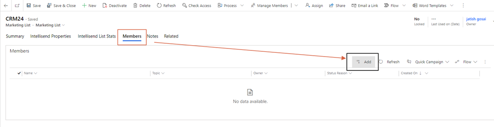

When you choose to Add, depending on who the marketing list is targeted at, that entity i.e. Lead, or Account or Contact will be created.

  

>Once the 'Targeted At', and 'List Type' are entered and the list saved, these cannot be changed. If a mistake was made, the marketing list would need to be deactivated and a new marketing list created.

A Deactivated list can be reactivated later if required.

  

When a dynamic list is created, use 'Manage Members' and then add in the criteria for the automatic membership.

  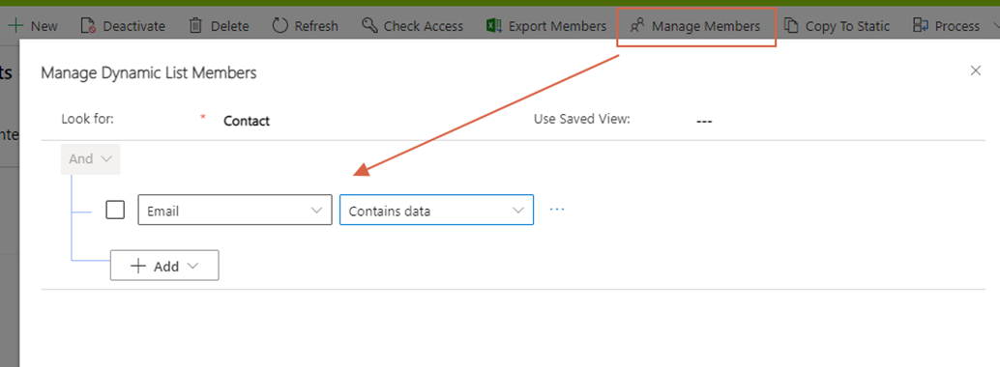

Click on **Find** to see the contacts or accounts that meet the criteria.
If satisfied choose Use Query

  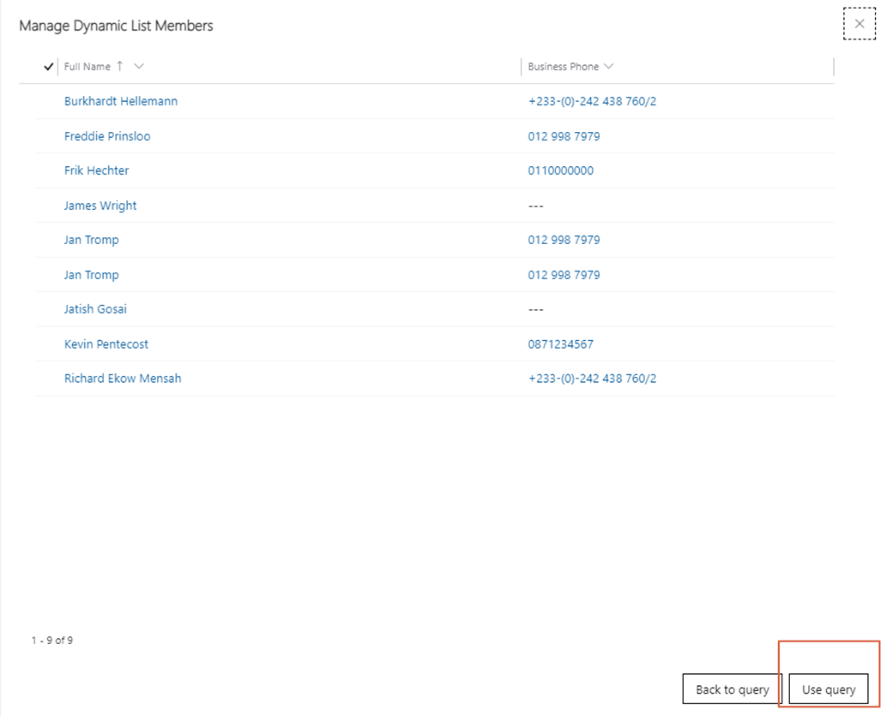

This will add the contacts to the marketing list.

  

>Note: In the future if a new contact is added and meets the criteria they will automatically be added to the dynamics marketing list.

### Create a Campaign
Click on **New** to create a campaign:

  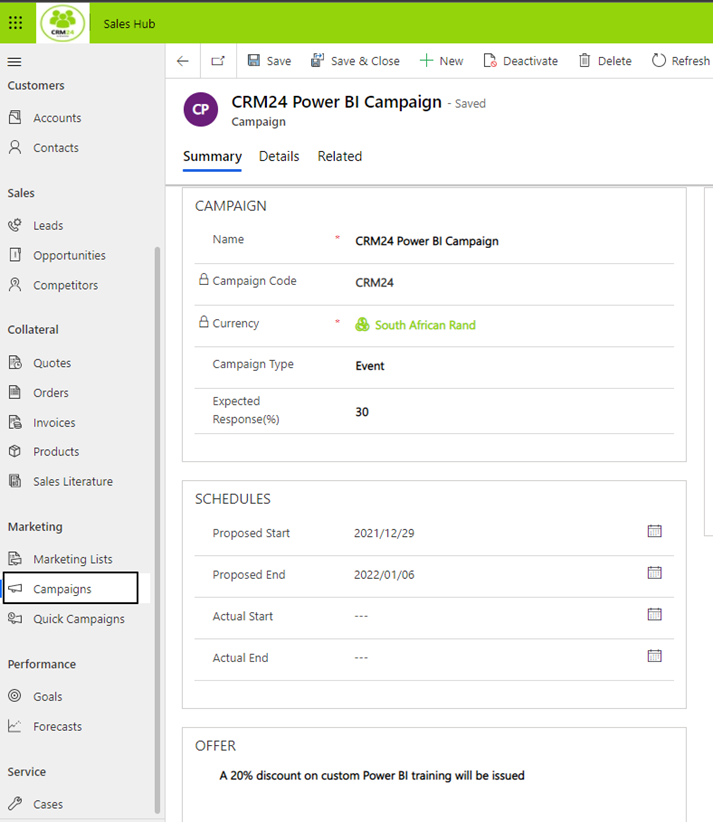

Once the campaign has been saved, there are 2 ways to associate the marketing list to the campaign.

The first is to return to the marketing list and then choose to add an Existing Campaign

  

The second is to from the campaign in the Marketing List section. Click on the 3 elipses and choose “Add Existing Marketing List”:

  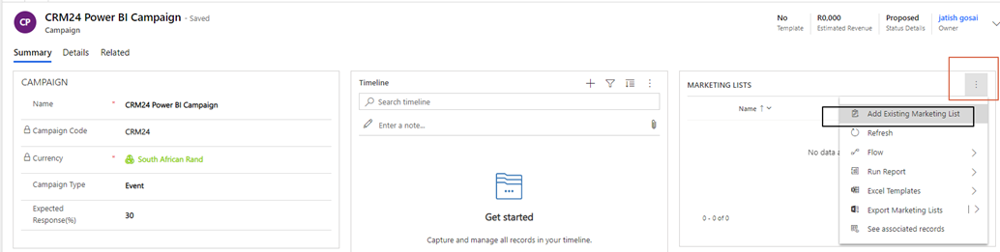

  

### Campaign targeted products
A target product can be added to a campaign if applicable

  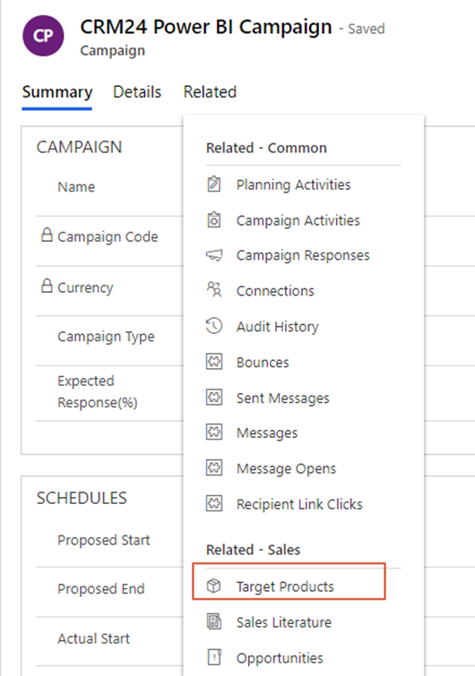

Choose **Add Existing Product**

  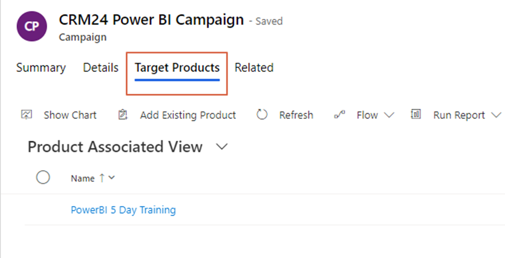

### Adding Sales Literature to a Campaign
From the Campaign, choose Related ➡️ Sales Literature, and then select to **Add Existing Sales Literature**

  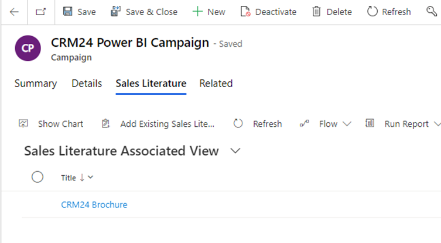

Note: The Product and Sales Literature would likely be added in advance

  

  

### Campaign Planning Activities
All the activities required to plan the campaign need to be added to the campaign. This is achieved by navigating to Related - > Planning Activities

  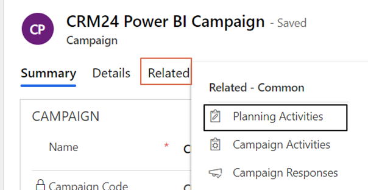

Next, add the various activities i.e. tasks, phone calls etc.

  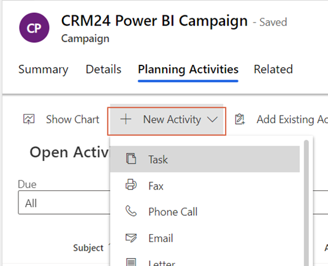

  

The list of these activities are then visible

  

Once the activities are complete, they can be marked as Complete

    

  

### Add Campaign Activities
Once the campaign is created and a marketing list has been associated, the various campaign activities can be created.

    

The status of the campaign can then be changed to “Ready to Launch”:

  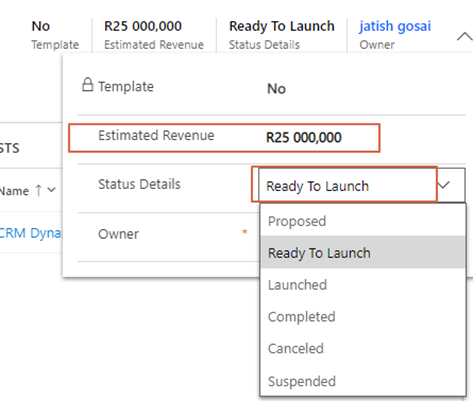

Once the status is changed, the Campaign Activity can be distributed to the people in the marketing list.

  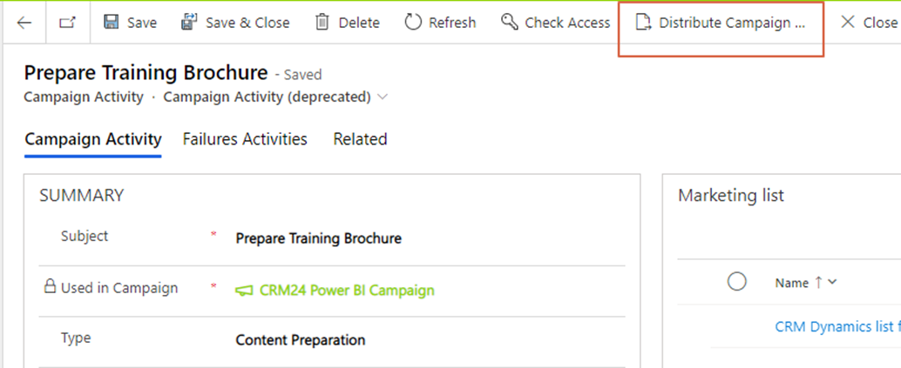

If the Channel is one that can be distributed i.e. Email, then the New Email box is provided, where you can choose to use a template or simply add the detail, and once done, click Distribute to send the email to all people in the Marketing List.

  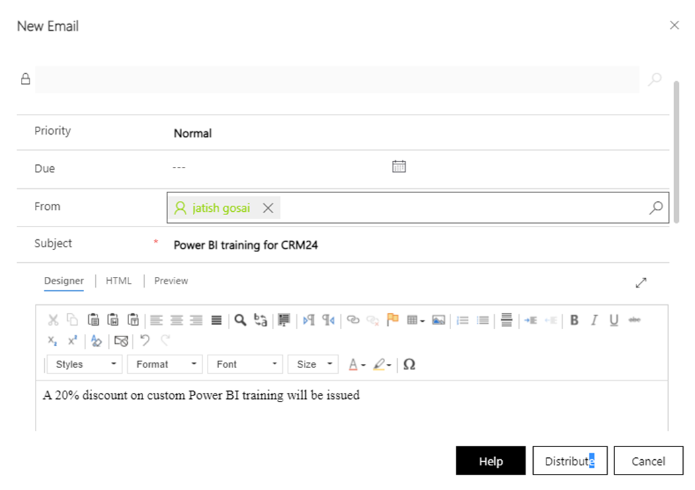

### Campaign responses
All email responses from the people who received the distributed email will lie in the Responses section of the Marketing Campaign.
Campaign Responses can also be captured manually in the Details tab on the Responses section

  

  

If the response is favourable, it can be converted to a lead (new or existing), or created as an opportunity. 

  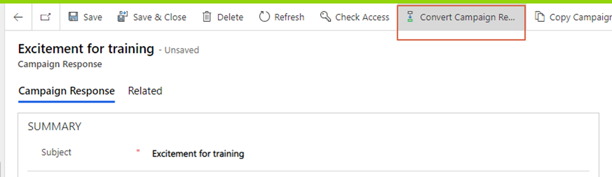

  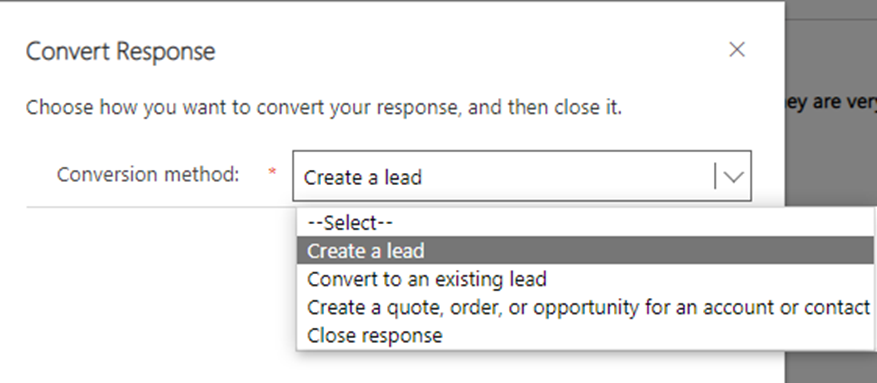

If you choose a Lead, it uses the information from the response as the basis for the Lead

  

In the new lead, the Source Campaign is populated

  

Once a campaign is complete, it can be deactivated.

  

### Create a Quick Campaign
A quick campaign is a single campaign activity geared toward a targeted audience. Track the success of your quick campaign through campaign responses, and convert the positive responses into new leads, quotes, orders, or opportunities.

The difference between a campaign and a quick campaign:

  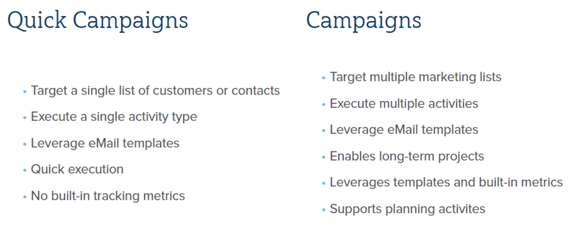  

  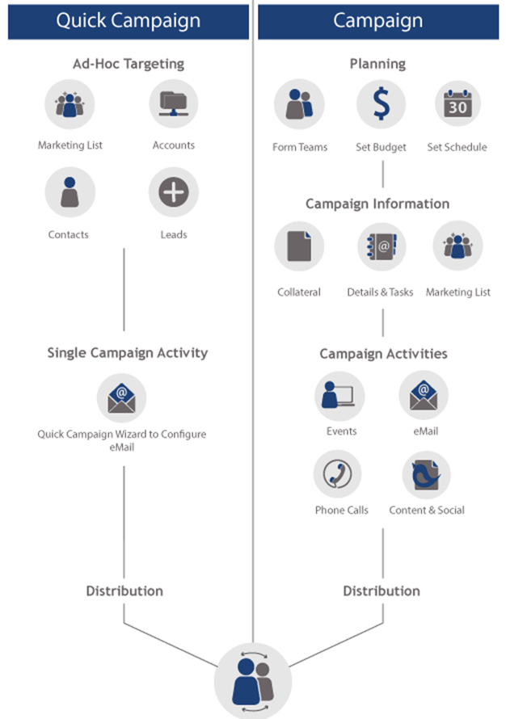

To create a quick campaign , from the marketing list, choose to “Create Quick Campaign”

  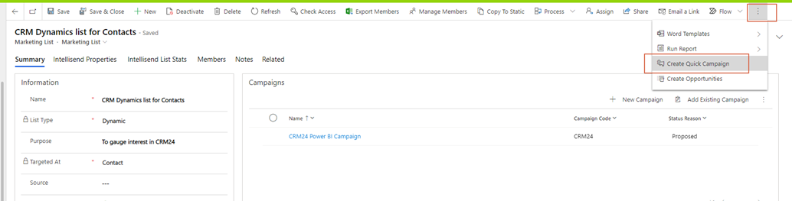 

This opens the Quick Campaign wizard:

  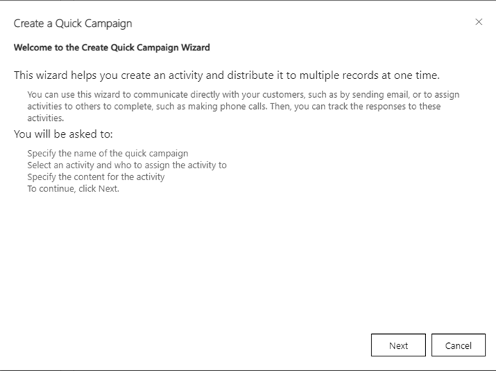

Specify a name for the quick campaign:

  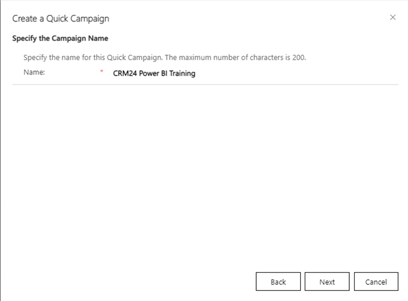

Specify the type of activity:

  

Specify the topic and description:

  

  

Once you have created the quick campaign, it is visible under Quick Campaigns.

  

You will see that the activity has been created for all members that were part of the marketing list.

  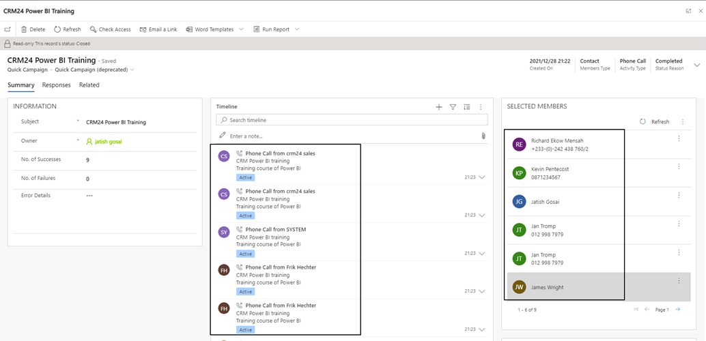

Once the activity has been completed, mark it as completed:

  

  

[**⬆️ Back to Top**](#sales-leads-opportunities-and-activities) &nbsp;&nbsp;&nbsp;&nbsp; [**🏠 Home**](/CRM24)

### Create a lead
A lead can be created directly, instead of from a campaign response:

  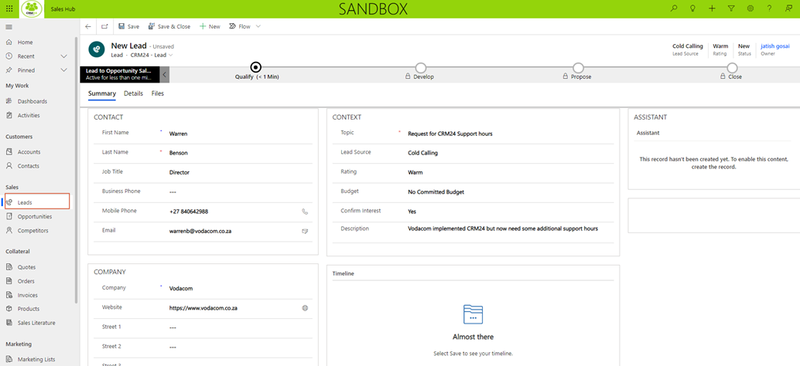

Once the basic info is completed, the Sales Process will guide you through additional info needed to be entered to progress through the Stages.

  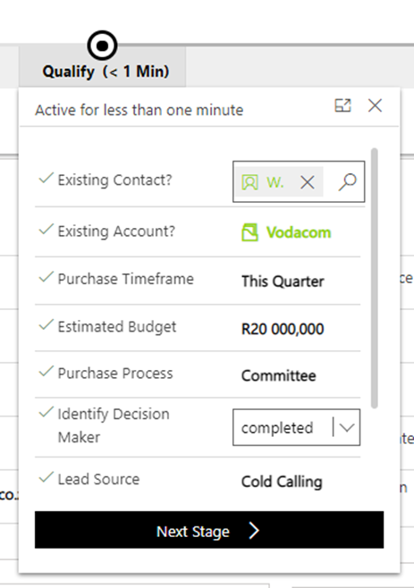

If a contact or account does not yet exist, they can be created here on the fly.

When trying to move to the next stage since no opportunity exists, one is prevented.

  

Before proceeding, the Lead needs to be qualified

  

>Note: if for some reason the prospect was no longer interested, you could choose to Disqualify the Lead

  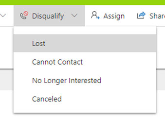

Once the Lead is qualified, the lead is transferred into an opportunity, and also the contact and account are created. 

[**⬆️ Back to Top**](#sales-leads-opportunities-and-activities) &nbsp;&nbsp;&nbsp;&nbsp; [**🏠 Home**](/CRM24)

### Opportunity
An opportunity can be created directly, or is created when a lead is qualified.

  

Once the basic information of an opportunity is completed, additional info around the decision process can then be completed

  

The product(s) related to the opportunity can be added.

A price list is chosen, and if one does not exist it needs to be added. Products cannot be added before a price list has been selected

  

The price list has a start and end date and Price List Items can be added to it.

  

On the option for Revenue either User Provided or System Generated options are available.

  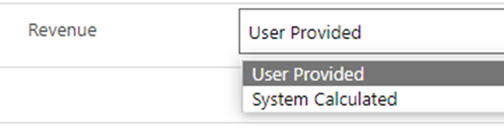 

- System generated is used when the price is determined by the products added.
- When User Provided is chosen you need to enter the estimated revenue manually

  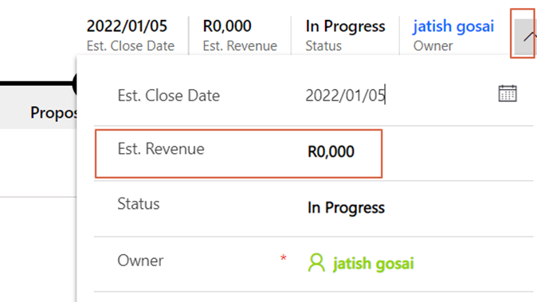

When adding the product, either an existing product can be chosen, or a new one created. Alternatively, the option of using a Write-In product exists (used on the opportunity but not saved as a product in CRM24)

  

The Estimated Revenue is updated with the sum of the prices of the products

  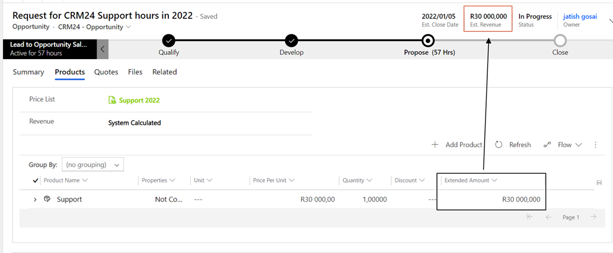

There is additional information to be completed for the opportunity, and to gather this information an activity like a Phone Call needs to be created

  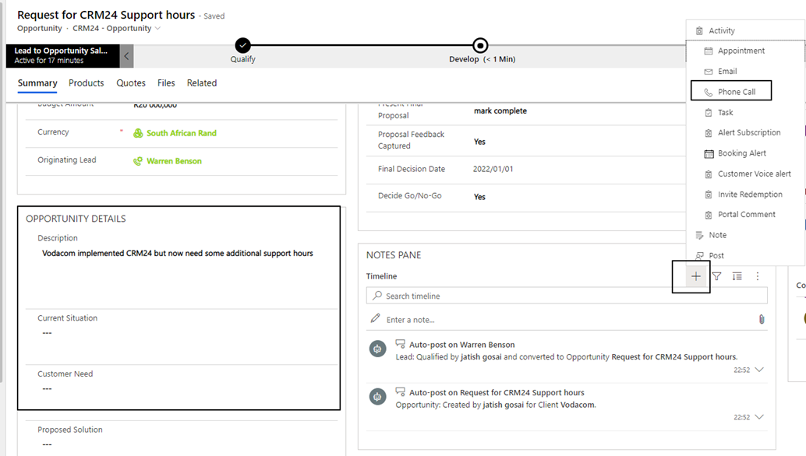

This will help clarify the current situation and customer need.

  

The Phone Call can be closed.

   
  

Once the need is confirmed, this detail can be added to the opportunity

  

Aditionally, the Develop stage fields can be completed

  

The Sales process prompts that stakeholders, a sales team and competitors be added. If there are no competitors in the system yet these can be created.

  

If an existing competitor does not exist it can be created.

  

Once these have been added one can move to the Next Stage: Propose.
The Propose stage requires that a quote be created.

  

## Create a Sales Quote
A sales quote can be created from within the Quote tab of the Opportunity, or directly from the Site Map.

  

or

  

 A Quote ID is populated, and if the quote was created from within the opportunity, then the same info from the opportunity is used on the quote.

  

>Note: If you want to get the products from a different opportunity you can click on “Get Products”.

  

Then choose the relevant opportunity.

  

Once the quote is ready, you can generate the quote using a Word Template.

  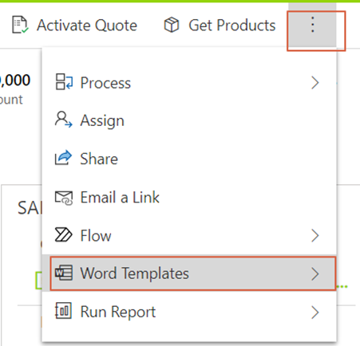 

An alternative would be to use the option 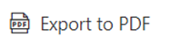.

  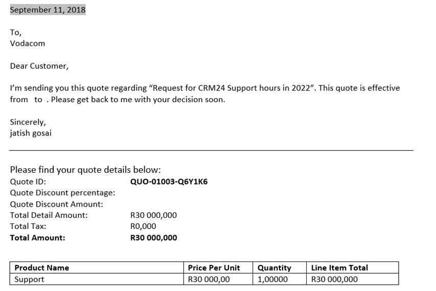

When the quote has been accepted, you can activate the quote  

Activating the Quote moves the quote out of Draft stage and allows you to create an order from the quote.The opportunity can now also move to the next stage.

  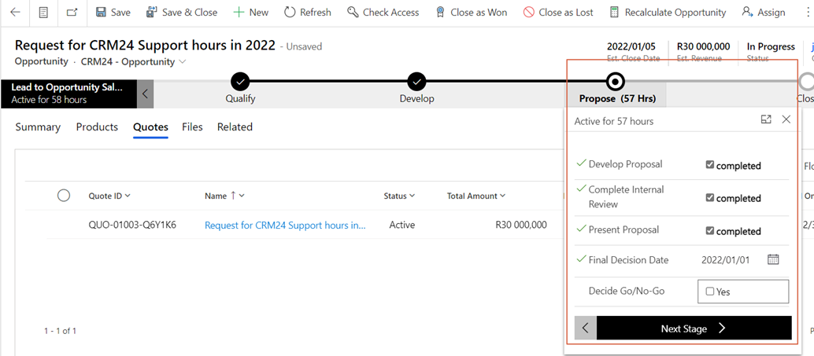

  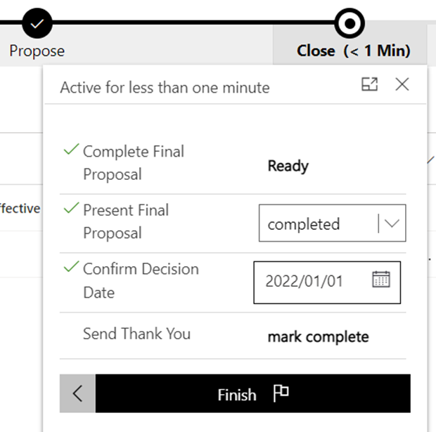

[**⬆️ Back to Top**](#sales-leads-opportunities-and-activities) &nbsp;&nbsp;&nbsp;&nbsp; [**🏠 Home**](/CRM24)

### Create an Order
An order can be created from a Quote, or direct from the site page.

  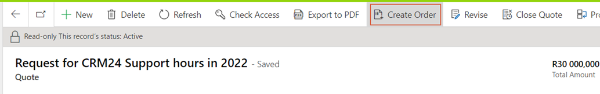

or 

  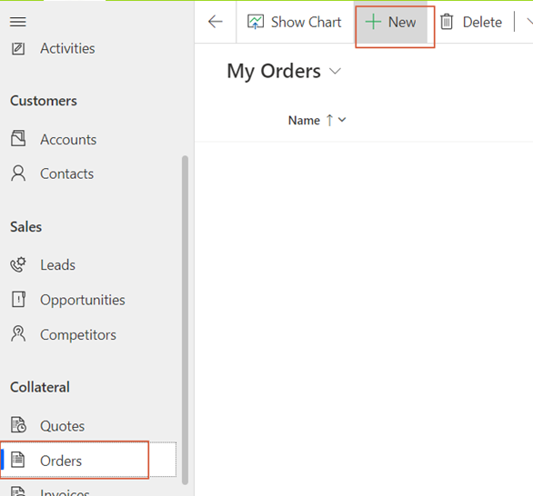

  

### Create an Invoice
An invoice can be created from an order, or directly from scratch.

  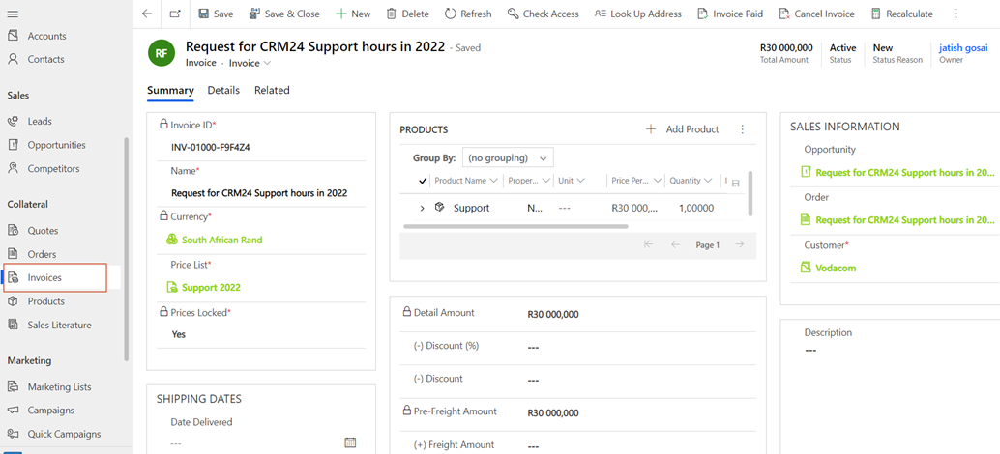

Once the Invoice has been settled, the invoiced can be marked in CRM24 as Paid.

  

  

## Finalising the opportunity
The opportunity can be closed as Won or Lost.

  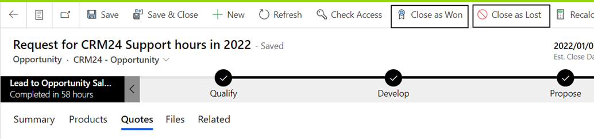
At this stage, the Actual Revenue can be edited (in case other revenue not accounted for was applicable)

  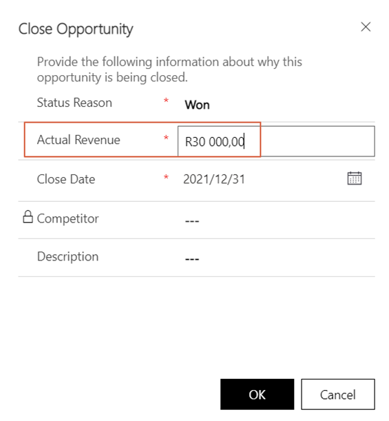

>Note: Before the opportunity can be closed, any active or draft quotes need to be closed.

  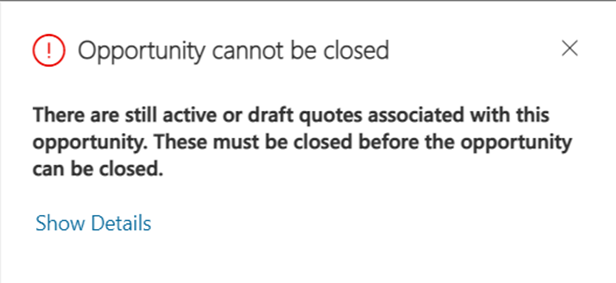

[**⬆️ Back to Top**](#sales-leads-opportunities-and-activities) &nbsp;&nbsp;&nbsp;&nbsp; [**🏠 Home**](/CRM24)