# Service Cases and Activities
The Customer Service module provides functions to service a customer.

- A **case** is the central record that identifies an incident that a customer has been facing for some products. 
- **Activities** are the means by which we communicate with a customer. For example 
  - we can make a phone call to a customer i.e.  it is an Outgoing phone call.
  - If a customer calls a customer representative for some breakdown purpose, then through a phone call, we can also create an activity called “Phone call” with direction Incoming, because the phone call came from the customer itself towards our business. 
    >These type of activities are normally the origin for a the generation of a case. 
- **Routing rules** can be set up, to route a specific incident or case to a **queue**, a team, or a user to handle that case in proper time.
A **queue** can be seen as a bucket where we assign some of the cases or incidents to that queue so, that the users who belongs to that queue will take action on that case record or incident record

- **Holiday schedules** are the timelines by which we can define which days of the year that represent a holiday for our business. These can then be used in cases to ensure SLA’s are based on the business operating times and days only.

- A **Service Level Agreement** (SLA) is used to provide a facility to the customer to solve any type of issue within a specified time limit.  

- **Entitlements** are the level of services that the business will provide to the customer e.g. granting the customer a 24/7 service for a product that we have sold 

- **Scheduling** is extending or deciding a timeline at a customer's place for servicing or installation or maintenance activities. 

[**⬆️ Back to Top**](#service-cases-and-activities) &nbsp;&nbsp;&nbsp;&nbsp; [**🏠 Home**](/CRM24)

## Cases, Activities and Queues

### New Case
Click on Cases in the left Navigation Pane, then on the top command bar, click “+ New”.

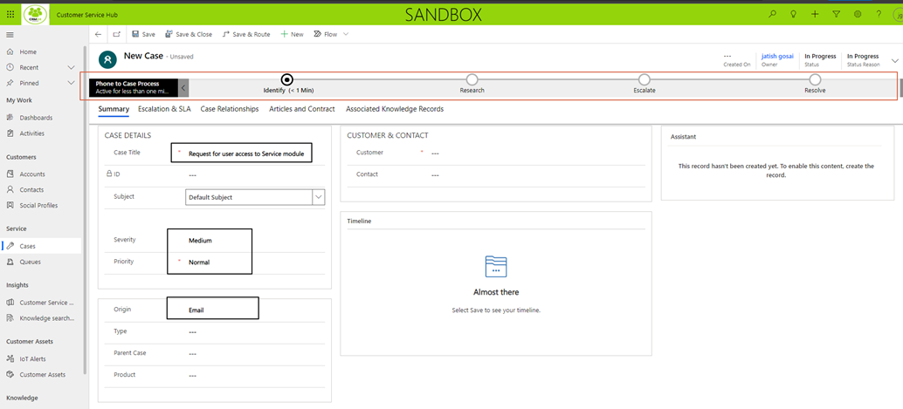

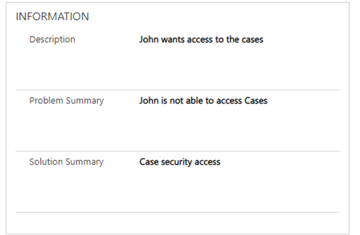

### Business Process ###
Use the Guided Process flow at the top to ensure the correct process is followed in resolving the case. 
Once the info for a stage is completed you can click on “Next stage” to move to the next stage.

### Add Activities
Add activities to show the work done in resolving the case. 

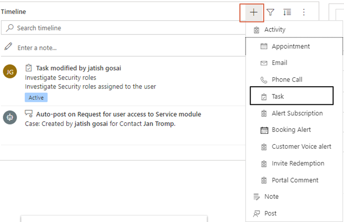

e.g. add a task

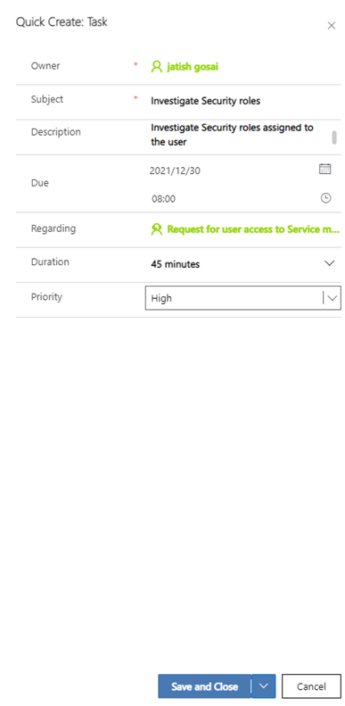

All activities need to be marked as Complete before the case can be marked as resolved.

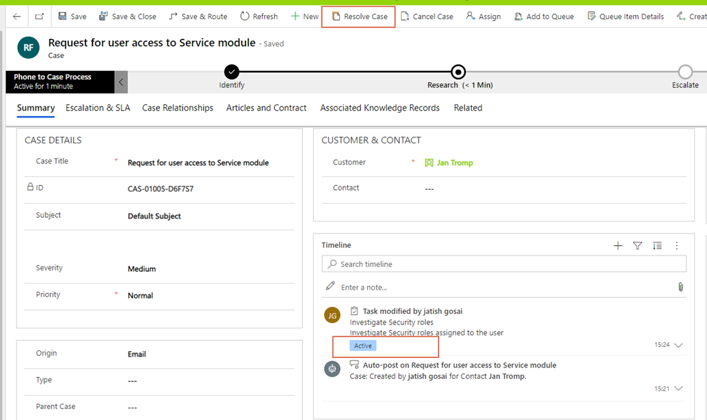

If the action is taken to Resolve Case and there is an open activity then the case is preventing from being resolved, unless you are willing for those activities to be auto cancelled.

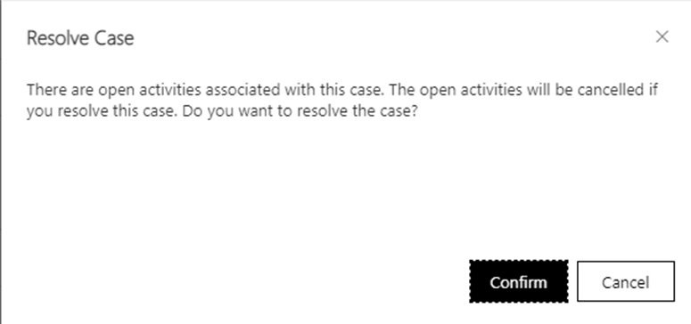

The activities can be actioned from the Timeline.

They can either be:
•	Assigned
•	Closed
•	Added to a Queue
•	Record Opened
•	Deleted
Once opened the activity can be marked as Complete

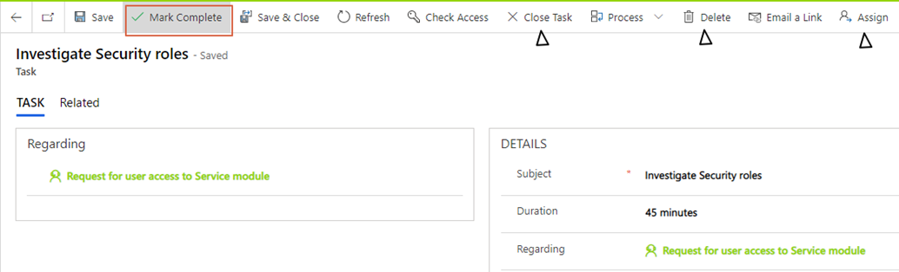

A note with an attachment can also be added to the Case – this could perhaps be a screenshot sent be a user of the error.

 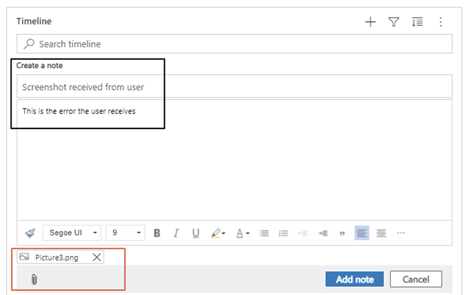

Part of the case resolve process is to determine if any escalation is required

Other tabs on the case are:
•	Case Relationships
•	Articles & Contracts
•	Associated Knowledge Records
•	Related

### Assignment
A case can be assigned to a user or a team

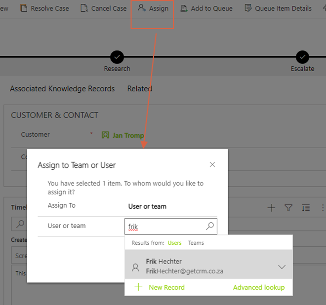

### Adding to Queue
A case can also be assigned to a queue and then from there a user can access the queue and 

If a queue does not exist it can be created

Once the case is assigned to a queue, a user that belongs to that queue can select the case and choose Pick – this thereby assigns the case to the user to work on.

### Resolve Case
When all case activity is complete, click on “Resolve” in the top command bar. The case is read only when resolved / finalised

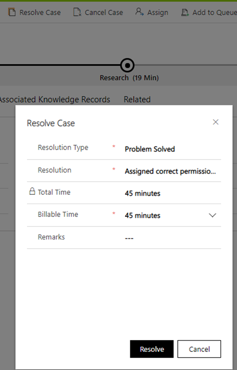

If a case needs to be reactivated after it was resolved i.e. perhaps an additional note needed to be added, then the case can be reactivated, then the additional activity added, and then the case resolved again.

Once the case is resolved the case can be seen from the List: My Resolved Cases

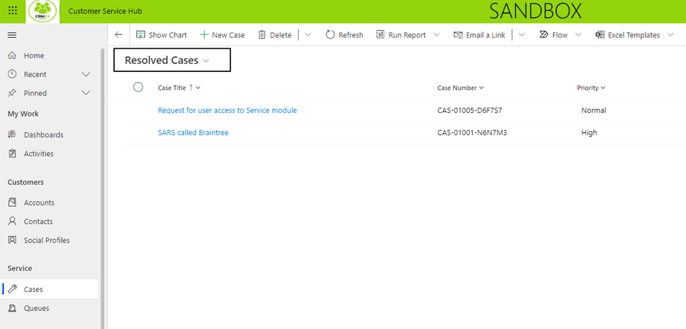

[**⬆️ Back to Top**](#service-cases-and-activities) &nbsp;&nbsp;&nbsp;&nbsp; [**🏠 Home**](/CRM24)